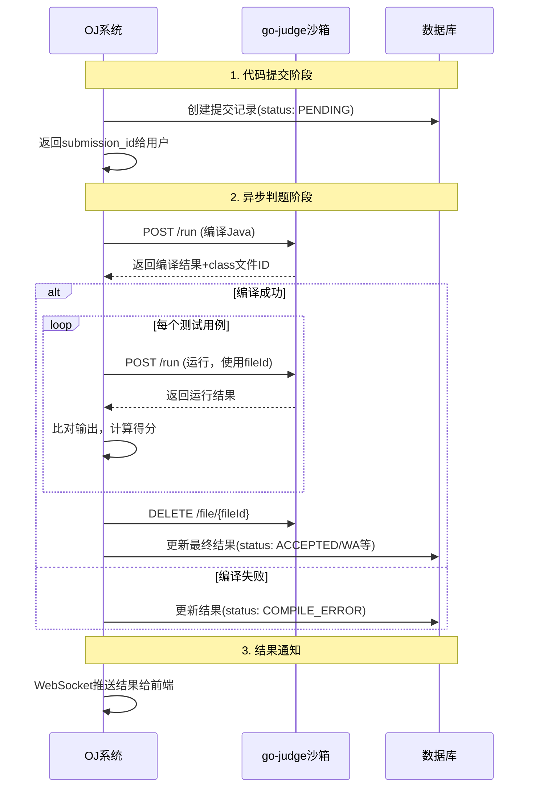

# 校园Java-OJ系统开发接口设计

## 📡 API接口规范

### 1. 接口设计原则

- **RESTful设计**: 遵循REST规范，语义化URL
- **统一响应格式**: 所有接口返回统一的JSON格式
- **版本控制**: API版本通过URL路径控制 `/api/v1/`
- **认证授权**: JWT Token + RBAC权限控制
- **参数校验**: 严格的输入参数验证
- **错误处理**: 标准化错误码和错误信息

### 2. 通用响应格式

```go
// 标准响应结构
type Response struct {
    Code    int         `json:"code"`    // 状态码
    Message string      `json:"message"` // 提示信息
    Data    interface{} `json:"data"`    // 响应数据
    TraceID string      `json:"trace_id,omitempty"` // 链路追踪ID
}

// 分页响应结构
type PageResponse struct {
    Response
    Pagination Pagination `json:"pagination"`
}

type Pagination struct {
    Page     int   `json:"page"`      // 当前页码
    PageSize int   `json:"page_size"` // 每页大小
    Total    int64 `json:"total"`     // 总记录数
    Pages    int   `json:"pages"`     // 总页数
}
```

### 3. 状态码定义

```go
const (
    // 成功状态码
    CodeSuccess = 200

    // 客户端错误 4xx
    CodeInvalidParam     = 400  // 参数错误
    CodeUnauthorized     = 401  // 未认证
    CodeForbidden        = 403  // 无权限
    CodeNotFound         = 404  // 资源不存在
    CodeDuplicateSubmit  = 429  // 重复提交

    // 服务端错误 5xx
    CodeInternalError    = 500  // 内部错误
    CodeDatabaseError    = 501  // 数据库错误
    CodeJudgeError       = 502  // 判题错误
    CodeServiceUnavail   = 503  // 服务不可用
)
```

## 🔐 认证授权接口

### 1. 用户注册
```
POST /api/v1/auth/register
Content-Type: application/json
```

**请求参数**:
```json
{
    "student_id": "2021001001",
    "username": "zhang_san",
    "password": "123456",
    "email": "zhangsan@school.edu.cn",
    "real_name": "张三",
    "class": "计算机科学与技术2021-1班",
    "grade": "2021"
}
```

**响应示例**:
```json
{
    "code": 200,
    "message": "注册成功",
    "data": {
        "user_id": "64f8a123b45c6789d0123456",
        "username": "zhang_san",
        "email": "zhangsan@school.edu.cn"
    }
}
```

### 2. 用户登录
```
POST /api/v1/auth/login
Content-Type: application/json
```

**请求参数**:
```json
{
    "username": "zhang_san",
    "password": "123456"
}
```

**响应示例**:
```json
{
    "code": 200,
    "message": "登录成功",
    "data": {
        "access_token": "eyJhbGciOiJIUzI1NiIsInR5cCI6IkpXVCJ9...",
        "token_type": "Bearer",
        "expires_in": 86400,
        "user": {
            "id": "64f8a123b45c6789d0123456",
            "username": "zhang_san",
            "real_name": "张三",
            "role": "student",
            "class": "计算机科学与技术2021-1班"
        }
    }
}
```

### 3. 用户登出
```
POST /api/v1/auth/logout
Authorization: Bearer {access_token}
```

**响应示例**:
```json
{
    "code": 200,
    "message": "登出成功",
    "data": null
}
```

## 👤 用户管理接口

### 1. 获取用户信息
```
GET /api/v1/users/profile
Authorization: Bearer {access_token}
```

**响应示例**:
```json
{
    "code": 200,
    "message": "success",
    "data": {
        "id": "64f8a123b45c6789d0123456",
        "student_id": "2021001001",
        "username": "zhang_san",
        "email": "zhangsan@school.edu.cn",
        "real_name": "张三",
        "role": "student",
        "class": "计算机科学与技术2021-1班",
        "grade": "2021",
        "stats": {
            "total_submissions": 45,
            "accepted_count": 23,
            "problems_solved": 18,
            "ranking": 12
        },
        "created_at": "2024-01-15T10:30:00Z"
    }
}
```

### 2. 更新用户信息
```
PUT /api/v1/users/profile
Authorization: Bearer {access_token}
Content-Type: application/json
```

**请求参数**:
```json
{
    "email": "new_email@school.edu.cn",
    "avatar": "http://example.com/avatar.jpg"
}
```

### 3. 修改密码
```
PUT /api/v1/users/password
Authorization: Bearer {access_token}
Content-Type: application/json
```

**请求参数**:
```json
{
    "old_password": "123456",
    "new_password": "654321"
}
```

## 📋 题目管理接口

### 1. 获取题目列表
```
GET /api/v1/problems?page=1&page_size=20&difficulty=easy&tags=array,string
Authorization: Bearer {access_token}
```

**查询参数**:
- `page`: 页码(默认1)
- `page_size`: 每页大小(默认20，最大100)
- `difficulty`: 难度筛选(easy/medium/hard)
- `tags`: 标签筛选(逗号分隔)
- `keyword`: 关键词搜索

**响应示例**:
```json
{
    "code": 200,
    "message": "success",
    "data": [
        {
            "id": "64f8a123b45c6789d0123457",
            "title": "两数之和",
            "difficulty": "easy",
            "tags": ["array", "hash-table"],
            "acceptance_rate": 0.65,
            "total_submissions": 1250,
            "accepted_count": 812,
            "created_at": "2024-01-10T08:00:00Z"
        }
    ],
    "pagination": {
        "page": 1,
        "page_size": 20,
        "total": 156,
        "pages": 8
    }
}
```

### 2. 获取题目详情
```
GET /api/v1/problems/{problem_id}
Authorization: Bearer {access_token}
```

**响应示例**:
```json
{
    "code": 200,
    "message": "success",
    "data": {
        "id": "64f8a123b45c6789d0123457",
        "title": "两数之和",
        "description": "给定一个整数数组 nums 和一个整数目标值 target...",
        "input_format": "第一行包含数组长度n和目标值target...",
        "output_format": "输出两个整数的下标...",
        "sample_input": "4 9\n2 7 11 15",
        "sample_output": "0 1",
        "time_limit": 1000,
        "memory_limit": 128,
        "difficulty": "easy",
        "tags": ["array", "hash-table"],
        "stats": {
            "total_submissions": 1250,
            "accepted_count": 812,
            "acceptance_rate": 0.65
        },
        "created_by": "teacher_wang",
        "created_at": "2024-01-10T08:00:00Z"
    }
}
```

### 3. 创建题目 (教师权限)
```
POST /api/v1/problems
Authorization: Bearer {access_token}
Content-Type: application/json
```

**请求参数**:
```json
{
    "title": "新题目标题",
    "description": "题目描述...",
    "input_format": "输入格式说明...",
    "output_format": "输出格式说明...",
    "sample_input": "样例输入",
    "sample_output": "样例输出",
    "time_limit": 1000,
    "memory_limit": 128,
    "difficulty": "medium",
    "tags": ["algorithm", "dp"],
    "test_cases": [
        {
            "input": "测试输入1",
            "output": "期望输出1",
            "score": 20,
            "is_public": false
        }
    ]
}
```

## 📝 代码提交接口

### 1. 提交代码
```
POST /api/v1/submissions
Authorization: Bearer {access_token}
Content-Type: application/json
```

**请求参数**:
```json
{
    "problem_id": "64f8a123b45c6789d0123457",
    "code": "public class Main {\n    public static void main(String[] args) {\n        // Java解题代码\n        System.out.println(\"Hello World\");\n    }\n}",
    "language": "java"
}
```

**响应示例**:
```json
{
    "code": 200,
    "message": "提交成功",
    "data": {
        "submission_id": "64f8a123b45c6789d0123458",
        "status": "PENDING",
        "submitted_at": "2024-01-15T14:30:00Z",
        "judge_info": {
            "estimated_time": "15s",
            "queue_position": 3
        }
    }
}
```

### 2. 查询提交状态
```
GET /api/v1/submissions/{submission_id}
Authorization: Bearer {access_token}
```

**响应示例**:
```json
{
    "code": 200,
    "message": "success",
    "data": {
        "id": "64f8a123b45c6789d0123458",
        "problem_id": "64f8a123b45c6789d0123457",
        "user_id": "64f8a123b45c6789d0123456",
        "code": "public class Main {...}",
        "language": "java",
        "status": "ACCEPTED",
        "score": 100,
        "time_used": 245,
        "memory_used": 8192,
        "compile_info": {
            "status": "SUCCESS",
            "time_used": 2456,
            "memory_used": 45678,
            "message": ""
        },
        "test_results": [
            {
                "test_case_id": "case1",
                "status": "ACCEPTED",
                "time_used": 45,
                "memory_used": 2048,
                "score": 20,
                "input": "4 9\n2 7 11 15",
                "expected_output": "0 1",
                "actual_output": "0 1",
                "judge_details": {
                    "go_judge_status": "Accepted",
                    "exit_status": 0,
                    "runtime_ns": 45000000
                }
            }
        ],
        "submitted_at": "2024-01-15T14:30:00Z",
        "judged_at": "2024-01-15T14:30:15Z"
    }
}
```

### 3. 获取提交列表
```
GET /api/v1/submissions?page=1&page_size=20&problem_id=xxx&status=ACCEPTED
Authorization: Bearer {access_token}
```

**查询参数**:
- `page`: 页码
- `page_size`: 每页大小
- `problem_id`: 题目ID筛选
- `status`: 状态筛选
- `language`: 语言筛选

**响应示例**:
```json
{
    "code": 200,
    "message": "success",
    "data": [
        {
            "id": "64f8a123b45c6789d0123458",
            "problem": {
                "id": "64f8a123b45c6789d0123457",
                "title": "两数之和"
            },
            "status": "ACCEPTED",
            "score": 100,
            "time_used": 245,
            "memory_used": 8192,
            "language": "java",
            "submitted_at": "2024-01-15T14:30:00Z"
        }
    ],
    "pagination": {
        "page": 1,
        "page_size": 20,
        "total": 45,
        "pages": 3
    }
}
```

## 📊 统计分析接口

### 1. 用户统计信息
```
GET /api/v1/stats/user/{user_id}
Authorization: Bearer {access_token}
```

**响应示例**:
```json
{
    "code": 200,
    "message": "success",
    "data": {
        "user": {
            "id": "64f8a123b45c6789d0123456",
            "username": "zhang_san",
            "real_name": "张三"
        },
        "summary": {
            "total_submissions": 45,
            "accepted_count": 23,
            "problems_solved": 18,
            "acceptance_rate": 0.51,
            "ranking": 12
        },
        "difficulty_stats": {
            "easy": {"solved": 8, "total": 10},
            "medium": {"solved": 7, "total": 15},
            "hard": {"solved": 3, "total": 8}
        },
        "recent_submissions": [
            {
                "problem_title": "两数之和",
                "status": "ACCEPTED",
                "submitted_at": "2024-01-15T14:30:00Z"
            }
        ]
    }
}
```

### 2. 班级排行榜
```
GET /api/v1/stats/ranking/class/{class_name}?page=1&page_size=50
Authorization: Bearer {access_token}
```

**响应示例**:
```json
{
    "code": 200,
    "message": "success",
    "data": [
        {
            "rank": 1,
            "user": {
                "id": "64f8a123b45c6789d0123456",
                "username": "zhang_san",
                "real_name": "张三",
                "student_id": "2021001001"
            },
            "stats": {
                "problems_solved": 25,
                "total_submissions": 68,
                "acceptance_rate": 0.74,
                "last_submission": "2024-01-15T16:45:00Z"
            }
        }
    ],
    "pagination": {
        "page": 1,
        "page_size": 50,
        "total": 32,
        "pages": 1
    }
}
```

### 3. 题目统计信息
```
GET /api/v1/stats/problem/{problem_id}
Authorization: Bearer {access_token}
```

**响应示例**:
```json
{
    "code": 200,
    "message": "success",
    "data": {
        "problem": {
            "id": "64f8a123b45c6789d0123457",
            "title": "两数之和"
        },
        "stats": {
            "total_submissions": 1250,
            "accepted_count": 812,
            "acceptance_rate": 0.65,
            "average_time": 245,
            "average_memory": 8192
        },
        "language_stats": {
            "java": {"submissions": 1250, "accepted": 812}
        },
        "difficulty_distribution": {
            "user_ratings": {"easy": 45, "medium": 12, "hard": 3}
        }
    }
}
```

## 🔧 管理员接口

### 1. 系统监控
```
GET /api/v1/admin/system/status
Authorization: Bearer {access_token}
X-Role: admin
```

**响应示例**:
```json
{
    "code": 200,
    "message": "success",
    "data": {
        "system": {
            "uptime": "15d 6h 32m",
            "version": "v1.0.0",
            "environment": "production"
        },
        "database": {
            "mongodb": {
                "status": "healthy",
                "connections": 25,
                "response_time": "2ms"
            },
            "redis": {
                "status": "healthy",
                "memory_usage": "156MB",
                "hit_rate": 0.95
            }
        },
        "queue": {
            "rabbitmq": {
                "status": "healthy",
                "pending_tasks": 3,
                "processing_rate": "45/min"
            }
        },
        "judge": {
            "sandboxes": [
                {
                    "id": "sandbox-1",
                    "status": "healthy",
                    "cpu_usage": 0.15,
                    "memory_usage": 0.32
                }
            ]
        }
    }
}
```

### 2. 用户管理
```
GET /api/v1/admin/users?page=1&page_size=50&role=student&class=计算机2021-1班
Authorization: Bearer {access_token}
X-Role: admin
```

**响应示例**:
```json
{
    "code": 200,
    "message": "success",
    "data": [
        {
            "id": "64f8a123b45c6789d0123456",
            "student_id": "2021001001",
            "username": "zhang_san",
            "real_name": "张三",
            "role": "student",
            "class": "计算机科学与技术2021-1班",
            "is_active": true,
            "last_login": "2024-01-15T16:45:00Z",
            "stats": {
                "problems_solved": 18,
                "total_submissions": 45
            }
        }
    ]
}
```

## 🔌 WebSocket实时通知

### 1. 连接建立
```
WebSocket: ws://localhost:8080/api/v1/ws
Authorization: Bearer {access_token}
```

### 2. 判题结果通知
```json
{
    "type": "submission_result",
    "data": {
        "submission_id": "64f8a123b45c6789d0123458",
        "status": "ACCEPTED",
        "score": 100,
        "time_used": 245,
        "memory_used": 8192,
        "judged_at": "2024-01-15T14:30:15Z",
        "compile_info": {
            "status": "SUCCESS",
            "time_used": 2456,
            "memory_used": 59801600,
            "message": ""
        },
        "test_progress": {
            "current_case": 5,
            "total_cases": 5,
            "passed_cases": 5
        },
        "judge_details": {
            "sandbox_instance": "go-judge-1",
            "file_cache_cleared": true,
            "total_judge_time": "12.5s",
            "compile_time_ns": 870867000,
            "avg_run_time_ns": 123456789
        }
    }
}
```

### 3. 判题进度通知（对应go-judge各阶段）
```json
{
    "type": "judge_progress",
    "data": {
        "submission_id": "64f8a123b45c6789d0123458",
        "stage": "COMPILING", // COMPILING, RUNNING, COMPLETED
        "progress": {
            "stage_name": "编译中",
            "current_step": 1,
            "total_steps": 6,
            "current_test_case": 0,
            "total_test_cases": 5,
            "go_judge_request": "POST /run (javac)"
        },
        "timestamp": "2024-01-15T14:30:08Z"
    }
}
```

### 4. 编译阶段通知
```json
{
    "type": "compile_result",
    "data": {
        "submission_id": "64f8a123b45c6789d0123458",
        "compile_status": "SUCCESS", // SUCCESS, FAILED
        "go_judge_response": {
            "status": "Accepted",
            "exitStatus": 0,
            "time": 870867000,
            "memory": 59801600,
            "fileIds": {
                "Main.class": "ABC123DEF456"
            }
        },
        "message": "编译成功，开始运行测试用例",
        "timestamp": "2024-01-15T14:30:10Z"
    }
}
```

### 5. 单个测试用例结果通知
```json
{
    "type": "test_case_result",
    "data": {
        "submission_id": "64f8a123b45c6789d0123458",
        "test_case_id": "case1",
        "test_case_index": 1,
        "status": "ACCEPTED",
        "score": 20,
        "go_judge_response": {
            "status": "Accepted",
            "exitStatus": 0,
            "time": 123456789,
            "memory": 45678912,
            "files": {
                "stdout": "0 1\n",
                "stderr": ""
            }
        },
        "expected_output": "0 1",
        "actual_output": "0 1",
        "judge_matched": true,
        "timestamp": "2024-01-15T14:30:12Z"
    }
}
```

### 4. 支持的消息类型
- `judge_progress`: 判题进度通知(编译中/运行中/完成)
- `submission_result`: 判题结果通知(最终结果)
- `test_case_result`: 单个测试用例结果
- `compile_result`: 编译结果通知
- `ranking_update`: 排名更新通知
- `system_notice`: 系统通知
- `contest_update`: 竞赛更新(预留)

## 🛠️ 错误处理

### 1. 常见错误响应
```json
{
    "code": 400,
    "message": "参数错误",
    "data": {
        "errors": [
            {
                "field": "code",
                "message": "代码不能为空"
            }
        ]
    },
    "trace_id": "abc123def456"
}
```

### 2. 判题相关错误码

| 错误码 | 描述 | go-judge状态映射 | 解决方案 |
|--------|------|----------------|----------|
| 1001 | 用户名已存在 | - | 更换用户名 |
| 1002 | 邮箱已被注册 | - | 更换邮箱或找回密码 |
| 1003 | 密码错误 | - | 检查密码输入 |
| 2001 | 题目不存在 | - | 检查题目ID |
| 2002 | 无权限访问题目 | - | 联系管理员 |
| 3001 | 代码长度超限 | - | 精简代码 |
| 3002 | 重复提交 | - | 等待10秒后重试 |
| 3003 | 判题队列满 | - | 稍后重试 |
| 3100 | 编译错误 | Nonzero Exit Status | 检查Java语法 |
| 3101 | 运行时错误 | Signalled/Nonzero Exit Status | 检查程序逻辑 |
| 3102 | 内存超限 | Memory Limit Exceeded | 优化内存使用 |
| 3103 | 时间超限 | Time Limit Exceeded | 优化算法效率 |
| 3104 | 输出超限 | Output Limit Exceeded | 检查输出格式 |
| 3105 | 危险系统调用 | Dangerous Syscall | 安全检查拒绝执行 |
| 3106 | 沙箱内部错误 | Internal Error | 联系系统管理员 |
| 3107 | 文件操作错误 | File Error | 检查文件路径和权限 |

### 2. 业务错误码

| 错误码 | 描述 | 解决方案 |
|--------|------|----------|
| 1001 | 用户名已存在 | 更换用户名 |
| 1002 | 邮箱已被注册 | 更换邮箱或找回密码 |
| 1003 | 密码错误 | 检查密码输入 |
| 2001 | 题目不存在 | 检查题目ID |
| 2002 | 无权限访问题目 | 联系管理员 |
| 3001 | 代码长度超限 | 精简代码 |
### 3. go-judge状态码对照表

| go-judge状态 | OJ系统状态 | 中文描述 | 处理逻辑 |
|-----------------|--------------|----------|----------|
| `Accepted` | `ACCEPTED` | 通过 | 正常处理 |
| `Memory Limit Exceeded` | `MEMORY_LIMIT_EXCEEDED` | 内存超限 | 记录内存使用量 |
| `Time Limit Exceeded` | `TIME_LIMIT_EXCEEDED` | 时间超限 | 记录时间使用量 |
| `Output Limit Exceeded` | `OUTPUT_LIMIT_EXCEEDED` | 输出超限 | 检查输出长度 |
| `Nonzero Exit Status` | `RUNTIME_ERROR` / `COMPILE_ERROR` | 非零退出 | 根据阶段区分编译/运行错误 |
| `Signalled` | `RUNTIME_ERROR` | 信号终止 | 段错误等运行时问题 |
| `Dangerous Syscall` | `DANGEROUS_SYSCALL` | 危险系统调用 | 安全检查拒绝 |
| `File Error` | `SYSTEM_ERROR` | 文件错误 | 系统内部错误 |
| `Internal Error` | `SYSTEM_ERROR` | 内部错误 | 系统内部错误 |

## 📋 接口测试

### 1. Postman集合
提供完整的Postman测试集合，包含：
- 环境变量配置
- 认证Token自动更新
- 所有接口的测试用例
- 自动化测试脚本
- go-judge沙箱状态模拟

### 2. API文档
基于OpenAPI 3.0规范生成：
- Swagger UI界面
- 在线测试功能
- 代码生成工具
- 接口变更历史
- go-judge集成文档

### 3. SDK支持
提供多语言SDK：
- JavaScript/TypeScript - 包含go-judge客户端
- Python - 支持异步调用
- Java - Spring Boot集成
- Go - 原生HTTP客户端

### 4. 判题集成测试

#### go-judge接口完整流程测试

**步骤1: 健康检查**
```bash
# 测试go-judge连接
curl -X GET http://localhost:5050/version
```

**步骤2: Java编译测试**
```bash
# 测试Java编译 - 完整请求示例
curl -X POST http://localhost:5050/run \
  -H "Content-Type: application/json" \
  -d '{
    "cmd": [{
      "args": ["/usr/bin/javac", "Main.java"],
      "env": [
        "PATH=/usr/bin:/bin",
        "JAVA_HOME=/usr/lib/jvm/java-17-openjdk-amd64"
      ],
      "files": [
        {"content": ""},
        {"name": "stdout", "max": 10240},
        {"name": "stderr", "max": 10240}
      ],
      "cpuLimit": 10000000000,
      "memoryLimit": 268435456,
      "procLimit": 50,
      "copyIn": {
        "Main.java": {
          "content": "public class Main {\n    public static void main(String[] args) {\n        System.out.println(\"Hello World\");\n    }\n}"
        }
      },
      "copyOut": ["stdout", "stderr"],
      "copyOutCached": ["Main.class"]
    }]
  }'
```

**期望编译响应**:
```json
[{
  "status": "Accepted",
  "exitStatus": 0,
  "time": 870867000,
  "memory": 59801600,
  "runTime": 360798111,
  "files": {
    "stderr": "",
    "stdout": ""
  },
  "fileIds": {
    "Main.class": "ABC123DEF456"
  }
}]
```

**步骤3: Java运行测试**
```bash
# 测试Java运行 - 使用缓存文件ID
curl -X POST http://localhost:5050/run \
  -H "Content-Type: application/json" \
  -d '{
    "cmd": [{
      "args": ["/usr/bin/java", "Main"],
      "env": [
        "PATH=/usr/bin:/bin",
        "JAVA_HOME=/usr/lib/jvm/java-17-openjdk-amd64"
      ],
      "files": [
        {"content": "测试输入数据"},
        {"name": "stdout", "max": 10240},
        {"name": "stderr", "max": 10240}
      ],
      "cpuLimit": 5000000000,
      "memoryLimit": 134217728,
      "procLimit": 1,
      "copyIn": {
        "Main.class": {"fileId": "ABC123DEF456"}
      },
      "copyOut": ["stdout", "stderr"]
    }]
  }'
```

**期望运行响应**:
```json
[{
  "status": "Accepted",
  "exitStatus": 0,
  "time": 123456789,
  "memory": 45678912,
  "runTime": 234567890,
  "files": {
    "stderr": "",
    "stdout": "Hello World\n"
  },
  "fileIds": {}
}]
```

**步骤4: 清理缓存文件**
```bash
# 删除缓存的class文件
curl -X DELETE http://localhost:5050/file/ABC123DEF456
```

#### 错误情况测试

**编译错误测试**:
```bash
# 提交语法错误的Java代码
curl -X POST http://localhost:5050/run \
  -H "Content-Type: application/json" \
  -d '{
    "cmd": [{
      "args": ["/usr/bin/javac", "Main.java"],
      "env": ["PATH=/usr/bin:/bin", "JAVA_HOME=/usr/lib/jvm/java-17-openjdk-amd64"],
      "files": [{"content": ""}, {"name": "stdout", "max": 10240}, {"name": "stderr", "max": 10240}],
      "cpuLimit": 10000000000,
      "memoryLimit": 268435456,
      "copyIn": {
        "Main.java": {
          "content": "public class Main { // 语法错误的代码 }"
        }
      },
      "copyOut": ["stdout", "stderr"]
    }]
  }'
```

**期望编译错误响应**:
```json
[{
  "status": "Nonzero Exit Status",
  "exitStatus": 1,
  "time": 500000000,
  "memory": 45678912,
  "files": {
    "stdout": "",
    "stderr": "Main.java:1: error: reached end of file while parsing\n"
  }
}]
```

## 🔄 判题流程与go-judge对接细节

### 1. 完整的判题流程映射



### 2. 关键数据转换规则

#### 时间转换
- go-judge返回: `"time": 123456789` (纳秒)
- OJ系统存储: `"time_used": 123` (毫秒)
- 转换公式: `time_used = time / 1000000`

#### 内存转换
- go-judge返回: `"memory": 45678912` (字节)
- OJ系统存储: `"memory_used": 44608` (KB)
- 转换公式: `memory_used = memory / 1024`

#### 状态转换
```go
// 状态映射函数示例
func mapGoJudgeStatus(goJudgeStatus string, exitStatus int, stage string) string {
    switch goJudgeStatus {
    case "Accepted":
        return "ACCEPTED"
    case "Memory Limit Exceeded":
        return "MEMORY_LIMIT_EXCEEDED"
    case "Time Limit Exceeded":
        return "TIME_LIMIT_EXCEEDED"
    case "Output Limit Exceeded":
        return "OUTPUT_LIMIT_EXCEEDED"
    case "Nonzero Exit Status":
        if stage == "compile" {
            return "COMPILE_ERROR"
        }
        return "RUNTIME_ERROR"
    case "Signalled":
        return "RUNTIME_ERROR"
    case "Dangerous Syscall":
        return "DANGEROUS_SYSCALL"
    case "File Error", "Internal Error":
        return "SYSTEM_ERROR"
    default:
        return "SYSTEM_ERROR"
    }
}
```

### 3. 文件缓存管理策略

#### 缓存生命周期
1. **编译阶段**: 生成class文件，获取fileId
2. **运行阶段**: 使用fileId多次运行测试用例
3. **清理阶段**: 所有测试完成后立即删除缓存文件
4. **异常处理**: 判题失败时也要清理缓存文件

#### 文件管理API使用
```bash
# 列出所有缓存文件
GET /file

# 获取特定文件
GET /file/{fileId}

# 删除缓存文件(必须调用)
DELETE /file/{fileId}
```

### 4. 错误处理完整方案

#### 编译错误处理
```json
{
  "status": "Nonzero Exit Status",
  "exitStatus": 1,
  "files": {
    "stderr": "Main.java:1: error: ';' expected"
  }
}
```
映射为OJ系统:
```json
{
  "status": "COMPILE_ERROR",
  "compile_info": {
    "status": "FAILED",
    "message": "Main.java:1: error: ';' expected"
  }
}
```

#### 运行时错误处理
- `exitStatus: 0, status: "Accepted"` → `ACCEPTED`
- `exitStatus: 1, status: "Nonzero Exit Status"` → `RUNTIME_ERROR`
- `exitStatus: 9, status: "Signalled"` → `RUNTIME_ERROR` (通常是SIGKILL)
- `exitStatus: 11, status: "Signalled"` → `RUNTIME_ERROR` (段错误SIGSEGV)

### 5. 性能优化建议

#### 连接池配置
```go
// HTTP客户端配置
client := &http.Client{
    Timeout: 30 * time.Second,
    Transport: &http.Transport{
        MaxIdleConns:        10,
        MaxIdleConnsPerHost: 2,
        IdleConnTimeout:     30 * time.Second,
    },
}
```

#### 并发控制
- 单个go-judge实例建议最大并发: 10
- 多实例负载均衡，权重分配
- 实例健康检查间隔: 10秒

这套接口设计完全兼容go-judge沙箱的实际使用方式，确保了判题流程的正确性和系统的稳定性。所有状态映射、数据转换、错误处理都与go-judge接口规范完全对应。