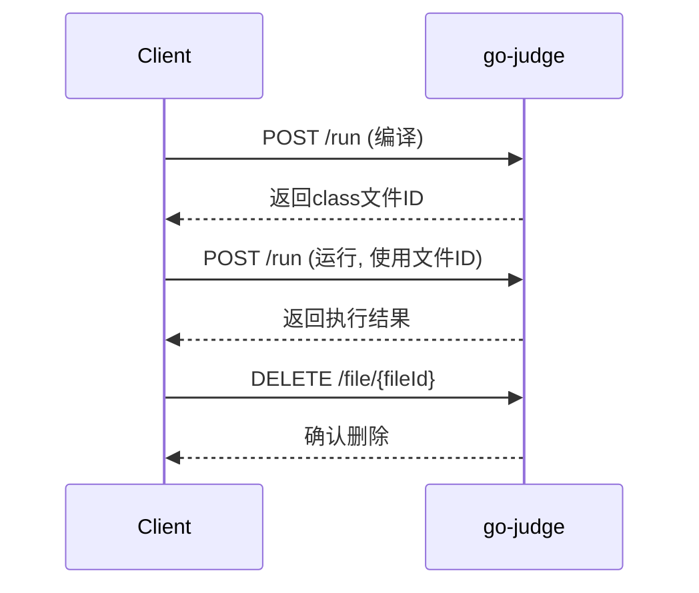

# go-judge 接口详细使用指南

## 📋 概述

go-judge 是一个沙箱服务，通过 REST API 提供代码执行功能。本文档详细说明接口参数、返回值含义以及完整的使用流程。

## 🔗 核心接口

### 1. 代码执行接口

**接口地址**: `POST /run`
**功能**: 执行用户代码（编译、运行）
**Content-Type**: `application/json`

### 2. 文件管理接口

- `GET /file` - 列出所有缓存文件
- `POST /file` - 上传文件到缓存
- `GET /file/{fileId}` - 下载指定文件
- `DELETE /file/{fileId}` - 删除指定文件

### 3. 系统信息接口

- `GET /version` - 获取版本信息
- `GET /config` - 获取系统配置

## 📝 请求参数详解

### 主请求结构

```json
{
  "cmd": [
    {
      "args": ["命令", "参数1", "参数2"],
      "env": ["环境变量1", "环境变量2"],
      "files": [文件描述符数组],
      "cpuLimit": CPU时间限制(纳秒),
      "clockLimit": 墙钟时间限制(纳秒),
      "memoryLimit": 内存限制(字节),
      "stackLimit": 栈限制(字节),
      "procLimit": 进程数限制,
      "cpuRate": CPU使用率限制,
      "strictMemoryLimit": 严格内存限制,
      "copyIn": {输入文件映射},
      "copyOut": [输出文件列表],
      "copyOutCached": [缓存输出文件列表],
      "copyOutMax": 输出文件大小限制
    }
  ],
  "pipeMapping": [管道映射配置]
}
```

### 参数详细说明

#### cmd 数组
- **类型**: `Array`
- **必需**: ✅
- **作用**: 定义要执行的命令列表，支持多个命令串联执行

#### args 参数
- **类型**: `Array<String>`
- **必需**: ✅
- **作用**: 定义执行的命令和参数
- **示例**: 
  ```json
  // Java 编译
  ["args": ["/usr/bin/javac", "Main.java"]]
  
  // Java 运行
  ["args": ["/usr/bin/java", "Main"]]
  
  // C++ 编译
  ["args": ["/usr/bin/g++", "main.cpp", "-o", "main"]]
  ```

#### env 参境变量
- **类型**: `Array<String>`
- **必需**: ❌
- **作用**: 设置程序执行时的环境变量
- **格式**: `"变量名=变量值"`
- **示例**:
  ```json
  "env": [
    "PATH=/usr/bin:/bin",
    "JAVA_HOME=/usr/lib/jvm/java-17-openjdk-amd64",
    "CLASSPATH=.",
    "LANG=C.UTF-8"
  ]
  ```

#### files 文件描述符
- **类型**: `Array<Object>`
- **必需**: ✅
- **作用**: 定义标准输入/输出/错误的处理方式
- **结构**:
  ```json
  [
    {"content": "输入内容"},           // stdin - 标准输入
    {"name": "stdout", "max": 10240}, // stdout - 标准输出
    {"name": "stderr", "max": 10240}  // stderr - 标准错误
  ]
  ```

#### 资源限制参数

| 参数 | 类型 | 单位 | 默认值 | 作用 |
|------|------|------|--------|------|
| `cpuLimit` | `int64` | 纳秒 | 1s | CPU 时间限制 |
| `clockLimit` | `int64` | 纳秒 | cpuLimit×3 | 墙钟时间限制 |
| `memoryLimit` | `int64` | 字节 | 128MB | 内存使用限制 |
| `stackLimit` | `int64` | 字节 | memoryLimit | 栈空间限制 |
| `procLimit` | `int` | 个数 | 1 | 最大进程数 |
| `cpuRate` | `float64` | 0-1 | 0 | CPU 使用率限制 |

**时间换算**:
- 1秒 = 1,000,000,000纳秒
- 编译建议: 10-30秒
- 运行建议: 1-5秒

**内存换算**:
- 1MB = 1,048,576字节
- 编译建议: 256-512MB
- 运行建议: 64-256MB

#### copyIn 输入文件
- **类型**: `Object`
- **必需**: ❌
- **作用**: 向沙箱传入文件
- **格式**:
  ```json
  "copyIn": {
    "文件名": {
      "content": "文件内容"    // 直接内容
    },
    "文件名": {
      "fileId": "缓存文件ID"   // 引用缓存文件
    }
  }
  ```

#### copyOut 输出文件
- **类型**: `Array<String>`
- **必需**: ❌
- **作用**: 从沙箱获取文件内容
- **示例**: `["stdout", "stderr", "output.txt"]`

#### copyOutCached 缓存输出
- **类型**: `Array<String>`
- **必需**: ❌
- **作用**: 缓存输出文件供后续使用（如编译生成的class文件）
- **示例**: `["Main.class", "program.exe"]`

## 📤 返回值详解

### 响应结构

```json
[
  {
    "status": "执行状态",
    "exitStatus": 退出码,
    "time": CPU时间(纳秒),
    "memory": 内存使用(字节),
    "runTime": 运行时间(纳秒),
    "procPeak": 峰值进程数,
    "files": {
      "文件名": "文件内容"
    },
    "fileIds": {
      "文件名": "缓存文件ID"
    },
    "fileError": [
      {
        "name": "文件名",
        "type": "错误类型",
        "message": "错误信息"
      }
    ]
  }
]
```

### 状态码详解

| 状态 | 含义 | 说明 | 处理建议 |
|------|------|------|----------|
| `Accepted` | 正常完成 | 程序成功执行完毕 | 继续下一步处理 |
| `Memory Limit Exceeded` | 内存超限 | 程序使用内存超过限制 | 提示用户优化内存使用 |
| `Time Limit Exceeded` | 时间超限 | 程序执行时间超过限制 | 提示用户优化算法效率 |
| `Output Limit Exceeded` | 输出超限 | 程序输出超过大小限制 | 检查输出内容和格式 |
| `File Error` | 文件错误 | 文件操作失败 | 检查文件路径和权限 |
| `Nonzero Exit Status` | 非零退出 | 程序异常退出 | 检查编译错误或运行时错误 |
| `Signalled` | 信号终止 | 程序被信号终止 | 检查段错误等运行时问题 |
| `Dangerous Syscall` | 危险系统调用 | 程序尝试危险操作 | 安全检查，拒绝执行 |
| `Internal Error` | 内部错误 | 沙箱内部错误 | 联系系统管理员 |

### 返回字段说明

#### status 执行状态
- **类型**: `String`
- **作用**: 表示程序执行的最终状态
- **值**: 见上表状态码

#### exitStatus 退出码
- **类型**: `int`
- **作用**: 程序的退出状态码
- **值**:
  - `0`: 正常退出
  - `1`: 一般错误（如编译错误）
  - `9`: 被SIGKILL终止（通常是超时）
  - `11`: 段错误（SIGSEGV）

#### time CPU时间
- **类型**: `int64`
- **单位**: 纳秒
- **作用**: 程序实际使用的CPU时间
- **换算**: `time / 1,000,000` = 毫秒

#### memory 内存使用
- **类型**: `int64`
- **单位**: 字节
- **作用**: 程序的最大内存使用量
- **换算**: `memory / 1024` = KB

#### runTime 运行时间
- **类型**: `int64`
- **单位**: 纳秒
- **作用**: 程序的墙钟时间（实际经过时间）

#### files 输出文件
- **类型**: `Object`
- **作用**: 包含程序的输出文件内容
- **常见键**:
  - `stdout`: 标准输出
  - `stderr`: 标准错误输出

#### fileIds 缓存文件ID
- **类型**: `Object`
- **作用**: 缓存文件的ID映射，用于后续引用
- **示例**: `{"Main.class": "ABC123DEF"}`

#### fileError 文件错误
- **类型**: `Array`
- **作用**: 文件操作相关的错误信息
- **字段**:
  - `name`: 文件名
  - `type`: 错误类型（如 CopyOutOpen）
  - `message`: 详细错误信息

## 🔄 完整使用流程

### Java 代码执行流程

#### 步骤1: 编译Java代码

```json
{
  "cmd": [{
    "args": ["/usr/bin/javac", "Main.java"],
    "env": [
      "PATH=/usr/bin:/bin",
      "JAVA_HOME=/usr/lib/jvm/java-17-openjdk-amd64"
    ],
    "files": [
      {"content": ""},
      {"name": "stdout", "max": 10240},
      {"name": "stderr", "max": 10240}
    ],
    "cpuLimit": 10000000000,
    "memoryLimit": 268435456,
    "procLimit": 50,
    "copyIn": {
      "Main.java": {
        "content": "public class Main {\n    public static void main(String[] args) {\n        System.out.println(\"Hello World\");\n    }\n}"
      }
    },
    "copyOut": ["stdout", "stderr"],
    "copyOutCached": ["Main.class"]
  }]
}
```

**编译响应示例**:
```json
[{
  "status": "Accepted",
  "exitStatus": 0,
  "time": 870867000,
  "memory": 59801600,
  "runTime": 360798111,
  "files": {
    "stderr": "",
    "stdout": ""
  },
  "fileIds": {
    "Main.class": "ABC123DEF456"
  }
}]
```

#### 步骤2: 运行Java程序

```json
{
  "cmd": [{
    "args": ["/usr/bin/java", "Main"],
    "env": [
      "PATH=/usr/bin:/bin",
      "JAVA_HOME=/usr/lib/jvm/java-17-openjdk-amd64"
    ],
    "files": [
      {"content": ""},
      {"name": "stdout", "max": 10240},
      {"name": "stderr", "max": 10240}
    ],
    "cpuLimit": 5000000000,
    "memoryLimit": 134217728,
    "procLimit": 1,
    "copyIn": {
      "Main.class": {
        "fileId": "ABC123DEF456"
      }
    },
    "copyOut": ["stdout", "stderr"]
  }]
}
```

**运行响应示例**:
```json
[{
  "status": "Accepted",
  "exitStatus": 0,
  "time": 123456789,
  "memory": 45678912,
  "runTime": 234567890,
  "files": {
    "stderr": "",
    "stdout": "Hello World\n"
  },
  "fileIds": {}
}]
```

#### 步骤3: 清理缓存文件

```http
DELETE /file/ABC123DEF456
```

**响应**: `200 OK`

## 🛠️ 使用模式

### 模式1: 编译+运行分离



**优势**: 
- 编译一次，多次运行
- 适合多个测试用例场景
- 节省资源

### 模式2: 一体化执行

```json
{
  "cmd": [
    {
      "args": ["/usr/bin/javac", "Main.java"],
      "copyIn": {"Main.java": {"content": "源代码"}},
      "copyOutCached": ["Main.class"]
    },
    {
      "args": ["/usr/bin/java", "Main"],
      "files": [{"content": "输入数据"}, {"name": "stdout", "max": 10240}],
      "copyIn": {"Main.class": {"fileId": ""}},
      "copyOut": ["stdout"]
    }
  ],
  "pipeMapping": [
    {"in": {"index": 0, "fd": 1}, "out": {"index": 1, "fd": 0}}
  ]
}
```

**优势**:
- 一次请求完成
- 自动文件传递
- 简化流程

## ⚠️ 注意事项

### 1. 文件管理

- **及时清理**: 缓存文件会占用内存，用完需立即删除
- **大小限制**: 单个文件有大小限制，默认64MB
- **生命周期**: 文件有TTL，过期自动删除

### 2. 资源设置

- **编译资源**: 通常需要更多时间和内存
- **运行资源**: 根据题目要求严格限制
- **进程限制**: 编译时可以多进程，运行时建议单进程

### 3. 错误处理

```go
// Go 语言错误处理示例
func handleJudgeResult(result JudgeResult) {
    switch result.Status {
    case "Accepted":
        // 处理成功
    case "Memory Limit Exceeded":
        // 内存超限
    case "Time Limit Exceeded":
        // 时间超限
    case "Compile Error":
        // 编译错误
        fmt.Println("编译错误:", result.Files["stderr"])
    case "Runtime Error":
        // 运行时错误
    default:
        // 其他错误
    }
}
```

### 4. 性能优化

- **连接复用**: 使用HTTP连接池
- **并发控制**: 限制同时请求数量
- **超时设置**: 设置合理的请求超时
- **重试机制**: 对临时失败进行重试

### 5. 安全考虑

- **输入验证**: 验证用户代码安全性
- **资源限制**: 严格设置资源上限
- **沙箱隔离**: 依赖go-judge的安全机制
- **日志监控**: 记录所有执行日志

## 📚 实用示例

### 示例1: ACM竞赛题目

```json
{
  "cmd": [{
    "args": ["/usr/bin/javac", "Main.java"],
    "env": ["PATH=/usr/bin:/bin", "JAVA_HOME=/usr/lib/jvm/java-17-openjdk-amd64"],
    "files": [{"content": ""}, {"name": "stdout", "max": 10240}, {"name": "stderr", "max": 10240}],
    "cpuLimit": 30000000000,
    "memoryLimit": 536870912,
    "procLimit": 50,
    "copyIn": {
      "Main.java": {
        "content": "import java.util.Scanner;\npublic class Main {\n    public static void main(String[] args) {\n        Scanner sc = new Scanner(System.in);\n        int a = sc.nextInt();\n        int b = sc.nextInt();\n        System.out.println(a + b);\n    }\n}"
      }
    },
    "copyOut": ["stdout", "stderr"],
    "copyOutCached": ["Main.class"]
  }]
}
```

### 示例2: 批量测试用例

```python
# Python 客户端示例
import requests

def judge_solution(code, test_cases):
    # 编译代码
    compile_request = {
        "cmd": [{
            "args": ["/usr/bin/javac", "Main.java"],
            "env": ["PATH=/usr/bin:/bin", "JAVA_HOME=/usr/lib/jvm/java-17-openjdk-amd64"],
            "files": [{"content": ""}, {"name": "stdout", "max": 10240}, {"name": "stderr", "max": 10240}],
            "cpuLimit": 10000000000,
            "memoryLimit": 268435456,
            "procLimit": 50,
            "copyIn": {"Main.java": {"content": code}},
            "copyOut": ["stdout", "stderr"],
            "copyOutCached": ["Main.class"]
        }]
    }
    
    compile_response = requests.post("http://localhost:5050/run", json=compile_request)
    compile_result = compile_response.json()[0]
    
    if compile_result["status"] != "Accepted":
        return {"status": "Compile Error", "error": compile_result["files"]["stderr"]}
    
    class_file_id = compile_result["fileIds"]["Main.class"]
    
    # 运行测试用例
    results = []
    for i, test_case in enumerate(test_cases):
        run_request = {
            "cmd": [{
                "args": ["/usr/bin/java", "Main"],
                "env": ["PATH=/usr/bin:/bin", "JAVA_HOME=/usr/lib/jvm/java-17-openjdk-amd64"],
                "files": [{"content": test_case["input"]}, {"name": "stdout", "max": 10240}, {"name": "stderr", "max": 10240}],
                "cpuLimit": 2000000000,
                "memoryLimit": 134217728,
                "procLimit": 1,
                "copyIn": {"Main.class": {"fileId": class_file_id}},
                "copyOut": ["stdout", "stderr"]
            }]
        }
        
        run_response = requests.post("http://localhost:5050/run", json=run_request)
        run_result = run_response.json()[0]
        
        results.append({
            "test_case": i + 1,
            "status": run_result["status"],
            "output": run_result["files"]["stdout"],
            "expected": test_case["output"],
            "time": run_result["time"] // 1000000,  # 转换为毫秒
            "memory": run_result["memory"] // 1024   # 转换为KB
        })
    
    # 清理缓存文件
    requests.delete(f"http://localhost:5050/file/{class_file_id}")
    
    return {"status": "Success", "results": results}
```

这个文档涵盖了 go-judge 接口的所有重要信息，帮助您理解和正确使用这个沙箱服务。


# Go-Judge 沙箱开发者接口指南

## 概述

go-judge 是一个高性能的代码执行沙箱服务，专为在线评测系统(OJ)设计。本指南将详细说明如何在开发中使用沙箱的编译和运行接口，并以"两数之和"算法题为例进行实战演示。

## 核心接口架构

### 基础 URL
```
http://localhost:5050/run
```

### 两种工作模式

#### 1. 接口模式 (Interface Mode)
- 适用场景：标准 ACM/ICPC 风格题目
- 特点：通过标准输入输出进行数据交互
- 判题方式：输出比较

#### 2. ACM 模式 (ACM Mode)  
- 适用场景：函数调用风格题目（如 LeetCode）
- 特点：通过函数接口进行数据交互
- 判题方式：返回值比较

## 编译请求接口

### 接口定义
```http
POST /run
Content-Type: application/json
```

### 编译请求参数结构

```json
{
  "cmd": [
    {
      "args": ["/usr/bin/javac", "-encoding", "UTF-8", "-cp", "/w", "Main.java"],
      "env": ["PATH=/usr/bin:/bin"],
      "files": [
        {
          "content": ""
        },
        {
          "name": "stdout",
          "max": 10240
        },
        {
          "name": "stderr", 
          "max": 10240
        }
      ],
      "cpuLimit": 10000000000,
      "memoryLimit": 134217728,
      "procLimit": 50,
      "copyIn": {
        "Main.java": {
          "content": "用户提交的Java源代码"
        }
      },
      "copyOut": ["stdout", "stderr"],
      "copyOutCached": ["Main.class"],
      "copyOutMax": 10240
    }
  ]
}
```

### 编译参数详解

| 参数 | 类型 | 必填 | 说明 |
|------|------|------|------|
| `args` | []string | 是 | 编译命令参数数组 |
| `env` | []string | 否 | 环境变量设置 |
| `files` | []object | 是 | 文件描述符配置 |
| `cpuLimit` | int64 | 是 | CPU时间限制(纳秒) |
| `memoryLimit` | int64 | 是 | 内存限制(字节) |
| `procLimit` | int | 是 | 进程数限制 |
| `copyIn` | map | 是 | 输入文件映射 |
| `copyOut` | []string | 否 | 输出文件列表 |
| `copyOutCached` | []string | 否 | 缓存文件列表 |
| `copyOutMax` | int64 | 否 | 输出文件大小限制 |

### 编译返回结果

```json
{
  "status": "Accepted",
  "exitStatus": 0,
  "time": 856000000,
  "memory": 12345678,
  "runTime": 856000000,
  "files": {
    "stdout": "",
    "stderr": ""
  },
  "fileIds": {
    "Main.class": "file_cache_id_here"
  }
}
```

### 编译返回参数解析

| 参数 | 类型 | 说明 |
|------|------|------|
| `status` | string | 执行状态 (Accepted/Compile Error/etc.) |
| `exitStatus` | int | 进程退出码 (0表示成功) |
| `time` | int64 | 实际执行时间(纳秒) |
| `memory` | int64 | 内存峰值使用量(字节) |
| `runTime` | int64 | 运行时间(纳秒) |
| `files` | map | 输出文件内容 |
| `fileIds` | map | 缓存文件ID映射 |

## 运行请求接口

### 运行请求参数结构

```json
{
  "cmd": [
    {
      "args": ["/usr/bin/java", "-cp", "/w", "Main"],
      "env": ["PATH=/usr/bin:/bin"],
      "files": [
        {
          "content": "测试用例输入数据"
        },
        {
          "name": "stdout",
          "max": 10240
        },
        {
          "name": "stderr",
          "max": 10240
        }
      ],
      "cpuLimit": 1000000000,
      "memoryLimit": 134217728,
      "procLimit": 50,
      "copyInCached": {
        "Main.class": "file_cache_id_here"
      },
      "copyOut": ["stdout", "stderr"],
      "copyOutMax": 10240
    }
  ]
}
```

### 运行参数详解

| 参数 | 类型 | 必填 | 说明 |
|------|------|------|------|
| `args` | []string | 是 | 运行命令参数数组 |
| `files[0].content` | string | 是 | 标准输入数据 |
| `copyInCached` | map | 否 | 使用缓存的编译文件 |
| `cpuLimit` | int64 | 是 | CPU时间限制(纳秒) |
| `memoryLimit` | int64 | 是 | 内存限制(字节) |

### 运行返回结果

```json
{
  "status": "Accepted",
  "exitStatus": 0,
  "time": 123456789,
  "memory": 23456789,
  "runTime": 123456789,
  "files": {
    "stdout": "程序输出结果",
    "stderr": ""
  }
}
```

## 实战案例：两数之和

### 题目分析
- **问题**：在数组中找出两个数之和等于目标值的下标
- **输入**：整数数组和目标值
- **输出**：两个整数的下标数组
- **约束**：时间复杂度优化，空间复杂度考虑

### 接口模式实现

#### 1. Java 解题代码

```java
import java.util.*;

public class Main {
    public static void main(String[] args) {
        Scanner scanner = new Scanner(System.in);
        
        // 读取数组长度
        int n = scanner.nextInt();
        int[] nums = new int[n];
        
        // 读取数组元素
        for (int i = 0; i < n; i++) {
            nums[i] = scanner.nextInt();
        }
        
        // 读取目标值
        int target = scanner.nextInt();
        
        // 调用解题方法
        int[] result = twoSum(nums, target);
        
        // 输出结果
        System.out.println(result[0] + " " + result[1]);
        
        scanner.close();
    }
    
    public static int[] twoSum(int[] nums, int target) {
        Map<Integer, Integer> map = new HashMap<>();
        for (int i = 0; i < nums.length; i++) {
            int complement = target - nums[i];
            if (map.containsKey(complement)) {
                return new int[]{map.get(complement), i};
            }
            map.put(nums[i], i);
        }
        throw new IllegalArgumentException("No two sum solution");
    }
}
```

#### 2. 测试用例格式

**输入格式：**
```
4
2 7 11 15
9
```

**输出格式：**
```
0 1
```

#### 3. 编译请求示例

```json
{
  "cmd": [
    {
      "args": ["/usr/bin/javac", "-encoding", "UTF-8", "-cp", "/w", "Main.java"],
      "env": ["PATH=/usr/bin:/bin"],
      "files": [
        {"content": ""},
        {"name": "stdout", "max": 10240},
        {"name": "stderr", "max": 10240}
      ],
      "cpuLimit": 10000000000,
      "memoryLimit": 134217728,
      "procLimit": 50,
      "copyIn": {
        "Main.java": {
          "content": "上述Java代码内容"
        }
      },
      "copyOut": ["stdout", "stderr"],
      "copyOutCached": ["Main.class"],
      "copyOutMax": 10240
    }
  ]
}
```

#### 4. 运行请求示例

```json
{
  "cmd": [
    {
      "args": ["/usr/bin/java", "-cp", "/w", "Main"],
      "env": ["PATH=/usr/bin:/bin"],
      "files": [
        {"content": "4\n2 7 11 15\n9\n"},
        {"name": "stdout", "max": 10240},
        {"name": "stderr", "max": 10240}
      ],
      "cpuLimit": 1000000000,
      "memoryLimit": 134217728,
      "procLimit": 50,
      "copyInCached": {
        "Main.class": "编译阶段返回的fileId"
      },
      "copyOut": ["stdout", "stderr"],
      "copyOutMax": 10240
    }
  ]
}
```

### ACM 模式实现

#### 1. 函数接口风格代码

```java
import java.util.*;

class Solution {
    public int[] twoSum(int[] nums, int target) {
        Map<Integer, Integer> map = new HashMap<>();
        for (int i = 0; i < nums.length; i++) {
            int complement = target - nums[i];
            if (map.containsKey(complement)) {
                return new int[]{map.get(complement), i};
            }
            map.put(nums[i], i);
        }
        return new int[0];
    }
}

public class Main {
    public static void main(String[] args) {
        Solution solution = new Solution();
        
        // 测试用例 1
        int[] nums1 = {2, 7, 11, 15};
        int target1 = 9;
        int[] result1 = solution.twoSum(nums1, target1);
        System.out.println(Arrays.toString(result1));
        
        // 测试用例 2  
        int[] nums2 = {3, 2, 4};
        int target2 = 6;
        int[] result2 = solution.twoSum(nums2, target2);
        System.out.println(Arrays.toString(result2));
        
        // 测试用例 3
        int[] nums3 = {3, 3};
        int target3 = 6;
        int[] result3 = solution.twoSum(nums3, target3);
        System.out.println(Arrays.toString(result3));
    }
}
```

## 开发调用流程

### 1. 完整的判题流程

```python
import requests
import json

class JudgeClient:
    def __init__(self, base_url="http://localhost:5050"):
        self.base_url = base_url
    
    def compile_and_run(self, source_code, input_data, time_limit=1000, memory_limit=128):
        """
        编译并运行代码
        
        Args:
            source_code: Java源代码
            input_data: 测试用例输入
            time_limit: 时间限制(毫秒)
            memory_limit: 内存限制(MB)
        
        Returns:
            编译和运行结果
        """
        
        # 步骤1: 编译请求
        compile_request = {
            "cmd": [{
                "args": ["/usr/bin/javac", "-encoding", "UTF-8", "-cp", "/w", "Main.java"],
                "env": ["PATH=/usr/bin:/bin"],
                "files": [
                    {"content": ""},
                    {"name": "stdout", "max": 10240},
                    {"name": "stderr", "max": 10240}
                ],
                "cpuLimit": 10000000000,  # 10秒编译时间
                "memoryLimit": memory_limit * 1024 * 1024,
                "procLimit": 50,
                "copyIn": {
                    "Main.java": {"content": source_code}
                },
                "copyOut": ["stdout", "stderr"],
                "copyOutCached": ["Main.class"],
                "copyOutMax": 10240
            }]
        }
        
        # 发送编译请求
        compile_response = requests.post(f"{self.base_url}/run", 
                                       json=compile_request)
        compile_result = compile_response.json()
        
        # 检查编译结果
        if compile_result[0]["status"] != "Accepted":
            return {
                "compile_status": compile_result[0]["status"],
                "compile_error": compile_result[0]["files"].get("stderr", ""),
                "success": False
            }
        
        # 获取编译后的class文件ID
        class_file_id = compile_result[0]["fileIds"]["Main.class"]
        
        # 步骤2: 运行请求
        run_request = {
            "cmd": [{
                "args": ["/usr/bin/java", "-cp", "/w", "Main"],
                "env": ["PATH=/usr/bin:/bin"],
                "files": [
                    {"content": input_data},
                    {"name": "stdout", "max": 10240},
                    {"name": "stderr", "max": 10240}
                ],
                "cpuLimit": time_limit * 1000000,  # 转换为纳秒
                "memoryLimit": memory_limit * 1024 * 1024,
                "procLimit": 50,
                "copyInCached": {
                    "Main.class": class_file_id
                },
                "copyOut": ["stdout", "stderr"],
                "copyOutMax": 10240
            }]
        }
        
        # 发送运行请求
        run_response = requests.post(f"{self.base_url}/run", 
                                   json=run_request)
        run_result = run_response.json()
        
        return {
            "compile_status": "Accepted",
            "run_status": run_result[0]["status"],
            "output": run_result[0]["files"].get("stdout", ""),
            "error": run_result[0]["files"].get("stderr", ""),
            "time_used": run_result[0]["time"] // 1000000,  # 转换为毫秒
            "memory_used": run_result[0]["memory"] // 1024,  # 转换为KB
            "exit_code": run_result[0]["exitStatus"],
            "success": run_result[0]["status"] == "Accepted"
        }

# 使用示例
if __name__ == "__main__":
    judge = JudgeClient()
    
    # 两数之和的Java代码
    java_code = """
import java.util.*;

public class Main {
    public static void main(String[] args) {
        Scanner scanner = new Scanner(System.in);
        int n = scanner.nextInt();
        int[] nums = new int[n];
        for (int i = 0; i < n; i++) {
            nums[i] = scanner.nextInt();
        }
        int target = scanner.nextInt();
        
        int[] result = twoSum(nums, target);
        System.out.println(result[0] + " " + result[1]);
        scanner.close();
    }
    
    public static int[] twoSum(int[] nums, int target) {
        Map<Integer, Integer> map = new HashMap<>();
        for (int i = 0; i < nums.length; i++) {
            int complement = target - nums[i];
            if (map.containsKey(complement)) {
                return new int[]{map.get(complement), i};
            }
            map.put(nums[i], i);
        }
        throw new IllegalArgumentException("No solution");
    }
}
"""
    
    # 测试用例
    test_input = "4\n2 7 11 15\n9\n"
    expected_output = "0 1"
    
    # 执行判题
    result = judge.compile_and_run(java_code, test_input)
    
    if result["success"]:
        actual_output = result["output"].strip()
        if actual_output == expected_output:
            print("✅ 测试通过")
            print(f"输出: {actual_output}")
            print(f"时间: {result['time_used']}ms")
            print(f"内存: {result['memory_used']}KB")
        else:
            print("❌ 输出不匹配")
            print(f"期望: {expected_output}")
            print(f"实际: {actual_output}")
    else:
        print("❌ 执行失败")
        print(f"编译状态: {result.get('compile_status')}")
        print(f"运行状态: {result.get('run_status')}")
        print(f"错误信息: {result.get('error')}")
```

### 2. 批量测试处理

```python
def batch_test(judge_client, source_code, test_cases):
    """
    批量测试用例执行
    
    Args:
        judge_client: JudgeClient实例
        source_code: 源代码
        test_cases: 测试用例列表 [{"input": "...", "expected": "..."}]
    
    Returns:
        测试结果统计
    """
    results = []
    passed = 0
    
    for i, test_case in enumerate(test_cases):
        print(f"执行测试用例 {i+1}...")
        
        result = judge_client.compile_and_run(
            source_code, 
            test_case["input"]
        )
        
        if result["success"]:
            actual = result["output"].strip()
            expected = test_case["expected"].strip()
            
            test_result = {
                "case_id": i + 1,
                "passed": actual == expected,
                "expected": expected,
                "actual": actual,
                "time": result["time_used"],
                "memory": result["memory_used"]
            }
            
            if test_result["passed"]:
                passed += 1
                print(f"✅ 测试用例 {i+1} 通过")
            else:
                print(f"❌ 测试用例 {i+1} 失败")
                print(f"  期望: {expected}")
                print(f"  实际: {actual}")
        else:
            test_result = {
                "case_id": i + 1,
                "passed": False,
                "error": result.get("error", "运行错误")
            }
            print(f"❌ 测试用例 {i+1} 执行失败: {test_result['error']}")
        
        results.append(test_result)
    
    print(f"\n测试总结: {passed}/{len(test_cases)} 通过")
    return results

# 两数之和测试用例
test_cases = [
    {
        "input": "4\n2 7 11 15\n9\n",
        "expected": "0 1"
    },
    {
        "input": "3\n3 2 4\n6\n", 
        "expected": "1 2"
    },
    {
        "input": "2\n3 3\n6\n",
        "expected": "0 1"
    }
]

# 执行批量测试
judge = JudgeClient()
batch_results = batch_test(judge, java_code, test_cases)
```

## 错误处理和状态码

### 常见状态码说明

| 状态码 | 含义 | 处理建议 |
|--------|------|----------|
| `Accepted` | 执行成功 | 继续处理输出结果 |
| `Compile Error` | 编译错误 | 检查源代码语法 |
| `Runtime Error` | 运行时错误 | 检查逻辑错误和异常处理 |
| `Time Limit Exceeded` | 超时 | 优化算法复杂度 |
| `Memory Limit Exceeded` | 内存超限 | 优化内存使用 |
| `Wrong Answer` | 答案错误 | 检查算法逻辑 |
| `System Error` | 系统错误 | 检查沙箱服务状态 |

### 错误处理最佳实践

```python
def handle_judge_result(result):
    """处理判题结果的通用方法"""
    
    if not result["success"]:
        # 编译错误
        if result.get("compile_status") != "Accepted":
            return {
                "verdict": "Compile Error",
                "message": result.get("compile_error", "编译失败"),
                "suggestion": "请检查代码语法错误"
            }
        
        # 运行时错误
        run_status = result.get("run_status")
        if run_status == "Runtime Error":
            return {
                "verdict": "Runtime Error", 
                "message": result.get("error", "运行时错误"),
                "suggestion": "检查数组越界、空指针等问题"
            }
        elif run_status == "Time Limit Exceeded":
            return {
                "verdict": "Time Limit Exceeded",
                "message": f"执行时间: {result.get('time_used', 0)}ms",
                "suggestion": "优化算法时间复杂度"
            }
        elif run_status == "Memory Limit Exceeded":
            return {
                "verdict": "Memory Limit Exceeded", 
                "message": f"内存使用: {result.get('memory_used', 0)}KB",
                "suggestion": "优化内存使用，减少不必要的数据结构"
            }
    
    return {
        "verdict": "Accepted",
        "time": result["time_used"],
        "memory": result["memory_used"],
        "output": result["output"]
    }
```

## 性能优化建议

### 1. 缓存机制利用
- 合理使用 `copyOutCached` 缓存编译后的文件
- 避免重复编译相同的代码

### 2. 资源限制设置
- 根据题目难度合理设置时间和内存限制
- 编译阶段给予充足的资源（特别是内存）

### 3. 并发处理
- 多个测试用例可以并行执行
- 注意控制并发数量，避免系统过载

### 4. 文件大小控制
- 合理设置 `copyOutMax` 限制输出文件大小
- 防止恶意代码产生大量输出

## 总结

本指南提供了使用 go-judge 沙箱服务进行代码判题的完整解决方案，包括：

1. **接口详解**：编译和运行接口的参数配置
2. **实战示例**：以"两数之和"为例的完整实现
3. **开发工具**：Python客户端封装和批量测试
4. **错误处理**：状态码解释和异常情况处理
5. **性能优化**：缓存机制和资源配置建议

通过本指南，开发者可以快速集成 go-judge 沙箱服务，构建稳定可靠的在线评测系统。


1. 统一接口方法
接口地址: POST http://localhost:5050/run
内容类型: application/json
说明: 编译和运行都使用同一个接口，通过不同参数配置实现不同功能
编译阶段的方法和参数
核心编译参数
参数类别	参数名	类型	必填	说明
执行命令	args	[]string	是	编译器命令参数，如 ["/usr/bin/javac", "-encoding", "UTF-8", "-cp", "/w", "Main.java"]
环境配置	env	[]string	否	环境变量设置，如 ["PATH=/usr/bin:/bin"]
文件管理	copyIn	map	是	输入文件映射，如 {"Main.java": {"content": "源代码"}}
文件管理	copyOut	[]string	否	输出文件列表，如 ["stdout", "stderr"]
文件管理	copyOutCached	[]string	否	需要缓存的文件，如 ["Main.class"]
资源限制	cpuLimit	int64	是	CPU时间限制(纳秒)，编译通常设为 10000000000 (10秒)
资源限制	memoryLimit	int64	是	内存限制(字节)，通常设为 134217728 (128MB)
资源限制	procLimit	int	是	进程数限制，通常设为 50
输出控制	copyOutMax	int64	否	输出文件大小限制
文件描述符配置
json
"files": [
  {"content": ""},                    // 标准输入 (编译时为空)
  {"name": "stdout", "max": 10240},   // 标准输出
  {"name": "stderr", "max": 10240}    // 标准错误
]
运行阶段的方法和参数
核心运行参数
参数类别	参数名	类型	必填	说明
执行命令	args	[]string	是	运行命令参数，如 ["/usr/bin/java", "-cp", "/w", "Main"]
输入数据	files[0].content	string	是	测试用例输入数据
文件管理	copyInCached	map	否	使用缓存文件，如 {"Main.class": "file_id"}
资源限制	cpuLimit	int64	是	CPU时间限制(纳秒)，运行通常设为 1000000000 (1秒)
资源限制	memoryLimit	int64	是	内存限制(字节)
资源限制	procLimit	int	是	进程数限制
沙箱安全机制提供的方法
结合用户记忆中的安全机制，go-judge 沙箱提供以下安全防护：
1. Namespace 隔离机制
PID 隔离: 进程无法看到宿主机其他进程
网络隔离: 阻止网络访问
文件系统隔离: 限制文件访问范围
2. Cgroup 资源控制
CPU 限制: 通过 cpuLimit 参数控制
内存限制: 通过 memoryLimit 参数控制
进程数限制: 通过 procLimit 参数控制
3. Seccomp 系统调用过滤
危险调用阻止: 自动阻止 ptrace、mount、reboot、socket 等危险系统调用
白名单机制: 只允许安全的系统调用执行
安全响应: 对恶意调用直接返回错误或终止进程
返回结果参数
编译/运行返回参数
参数名	类型	说明
status	string	执行状态 (Accepted, Compile Error, Runtime Error, Time Limit Exceeded, 等)
exitStatus	int	进程退出码 (0表示成功)
time	int64	实际执行时间(纳秒)
memory	int64	内存峰值使用量(字节)
runTime	int64	运行时间(纳秒)
files	map	输出文件内容 (stdout, stderr)
fileIds	map	缓存文件ID映射 (仅编译阶段返回)
实用示例
编译请求示例
json
{
  "cmd": [{
    "args": ["/usr/bin/javac", "-encoding", "UTF-8", "-cp", "/w", "Main.java"],
    "env": ["PATH=/usr/bin:/bin"],
    "files": [
      {"content": ""},
      {"name": "stdout", "max": 10240},
      {"name": "stderr", "max": 10240}
    ],
    "cpuLimit": 10000000000,
    "memoryLimit": 134217728,
    "procLimit": 50,
    "copyIn": {"Main.java": {"content": "Java源代码"}},
    "copyOut": ["stdout", "stderr"],
    "copyOutCached": ["Main.class"],
    "copyOutMax": 10240
  }]
}
运行请求示例
json
{
  "cmd": [{
    "args": ["/usr/bin/java", "-cp", "/w", "Main"],
    "env": ["PATH=/usr/bin:/bin"],
    "files": [
      {"content": "测试用例输入"},
      {"name": "stdout", "max": 10240},
      {"name": "stderr", "max": 10240}
    ],
    "cpuLimit": 1000000000,
    "memoryLimit": 134217728,
    "procLimit": 50,
    "copyInCached": {"Main.class": "缓存文件ID"},
    "copyOut": ["stdout", "stderr"],
    "copyOutMax": 10240
  }]
}
总结
go-judge 沙箱通过统一的 /run 接口提供编译和运行功能，具备完善的参数控制体系：
资源管理: CPU、内存、进程数的精确控制
文件管理: 灵活的文件输入输出和缓存机制
安全防护: 多层次安全隔离和系统调用过滤
错误处理: 详细的状态码和错误信息返回
性能优化: 编译结果缓存和并发支持
这些方法和参数为构建安全、高效的在线评测系统提供了强大的基础支撑。