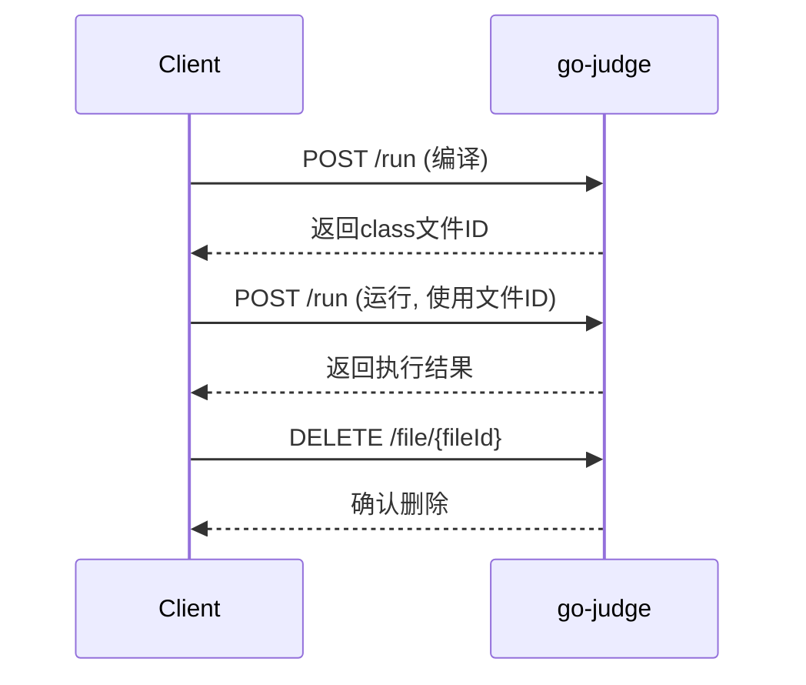

# go-judge 接口详细使用指南

## 📋 概述

go-judge 是一个沙箱服务，通过 REST API 提供代码执行功能。本文档详细说明接口参数、返回值含义以及完整的使用流程。

## 🔗 核心接口

### 1. 代码执行接口

**接口地址**: `POST /run`
**功能**: 执行用户代码（编译、运行）
**Content-Type**: `application/json`

### 2. 文件管理接口

- `GET /file` - 列出所有缓存文件
- `POST /file` - 上传文件到缓存
- `GET /file/{fileId}` - 下载指定文件
- `DELETE /file/{fileId}` - 删除指定文件

### 3. 系统信息接口

- `GET /version` - 获取版本信息
- `GET /config` - 获取系统配置

## 📝 请求参数详解

### 主请求结构

```json
{
  "cmd": [
    {
      "args": ["命令", "参数1", "参数2"],
      "env": ["环境变量1", "环境变量2"],
      "files": [文件描述符数组],
      "cpuLimit": CPU时间限制(纳秒),
      "clockLimit": 墙钟时间限制(纳秒),
      "memoryLimit": 内存限制(字节),
      "stackLimit": 栈限制(字节),
      "procLimit": 进程数限制,
      "cpuRate": CPU使用率限制,
      "strictMemoryLimit": 严格内存限制,
      "copyIn": {输入文件映射},
      "copyOut": [输出文件列表],
      "copyOutCached": [缓存输出文件列表],
      "copyOutMax": 输出文件大小限制
    }
  ],
  "pipeMapping": [管道映射配置]
}
```

### 参数详细说明

#### cmd 数组
- **类型**: `Array`
- **必需**: ✅
- **作用**: 定义要执行的命令列表，支持多个命令串联执行

#### args 参数
- **类型**: `Array<String>`
- **必需**: ✅
- **作用**: 定义执行的命令和参数
- **示例**: 
  ```json
  // Java 编译
  ["args": ["/usr/bin/javac", "Main.java"]]
  
  // Java 运行
  ["args": ["/usr/bin/java", "Main"]]
  
  // C++ 编译
  ["args": ["/usr/bin/g++", "main.cpp", "-o", "main"]]
  ```

#### env 参境变量
- **类型**: `Array<String>`
- **必需**: ❌
- **作用**: 设置程序执行时的环境变量
- **格式**: `"变量名=变量值"`
- **示例**:
  ```json
  "env": [
    "PATH=/usr/bin:/bin",
    "JAVA_HOME=/usr/lib/jvm/java-17-openjdk-amd64",
    "CLASSPATH=.",
    "LANG=C.UTF-8"
  ]
  ```

#### files 文件描述符
- **类型**: `Array<Object>`
- **必需**: ✅
- **作用**: 定义标准输入/输出/错误的处理方式
- **结构**:
  ```json
  [
    {"content": "输入内容"},           // stdin - 标准输入
    {"name": "stdout", "max": 10240}, // stdout - 标准输出
    {"name": "stderr", "max": 10240}  // stderr - 标准错误
  ]
  ```

#### 资源限制参数

| 参数 | 类型 | 单位 | 默认值 | 作用 |
|------|------|------|--------|------|
| `cpuLimit` | `int64` | 纳秒 | 1s | CPU 时间限制 |
| `clockLimit` | `int64` | 纳秒 | cpuLimit×3 | 墙钟时间限制 |
| `memoryLimit` | `int64` | 字节 | 128MB | 内存使用限制 |
| `stackLimit` | `int64` | 字节 | memoryLimit | 栈空间限制 |
| `procLimit` | `int` | 个数 | 1 | 最大进程数 |
| `cpuRate` | `float64` | 0-1 | 0 | CPU 使用率限制 |

**时间换算**:
- 1秒 = 1,000,000,000纳秒
- 编译建议: 10-30秒
- 运行建议: 1-5秒

**内存换算**:
- 1MB = 1,048,576字节
- 编译建议: 256-512MB
- 运行建议: 64-256MB

#### copyIn 输入文件
- **类型**: `Object`
- **必需**: ❌
- **作用**: 向沙箱传入文件
- **格式**:
  ```json
  "copyIn": {
    "文件名": {
      "content": "文件内容"    // 直接内容
    },
    "文件名": {
      "fileId": "缓存文件ID"   // 引用缓存文件
    }
  }
  ```

#### copyOut 输出文件
- **类型**: `Array<String>`
- **必需**: ❌
- **作用**: 从沙箱获取文件内容
- **示例**: `["stdout", "stderr", "output.txt"]`

#### copyOutCached 缓存输出
- **类型**: `Array<String>`
- **必需**: ❌
- **作用**: 缓存输出文件供后续使用（如编译生成的class文件）
- **示例**: `["Main.class", "program.exe"]`

## 📤 返回值详解

### 响应结构

```json
[
  {
    "status": "执行状态",
    "exitStatus": 退出码,
    "time": CPU时间(纳秒),
    "memory": 内存使用(字节),
    "runTime": 运行时间(纳秒),
    "procPeak": 峰值进程数,
    "files": {
      "文件名": "文件内容"
    },
    "fileIds": {
      "文件名": "缓存文件ID"
    },
    "fileError": [
      {
        "name": "文件名",
        "type": "错误类型",
        "message": "错误信息"
      }
    ]
  }
]
```

### 状态码详解

| 状态 | 含义 | 说明 | 处理建议 |
|------|------|------|----------|
| `Accepted` | 正常完成 | 程序成功执行完毕 | 继续下一步处理 |
| `Memory Limit Exceeded` | 内存超限 | 程序使用内存超过限制 | 提示用户优化内存使用 |
| `Time Limit Exceeded` | 时间超限 | 程序执行时间超过限制 | 提示用户优化算法效率 |
| `Output Limit Exceeded` | 输出超限 | 程序输出超过大小限制 | 检查输出内容和格式 |
| `File Error` | 文件错误 | 文件操作失败 | 检查文件路径和权限 |
| `Nonzero Exit Status` | 非零退出 | 程序异常退出 | 检查编译错误或运行时错误 |
| `Signalled` | 信号终止 | 程序被信号终止 | 检查段错误等运行时问题 |
| `Dangerous Syscall` | 危险系统调用 | 程序尝试危险操作 | 安全检查，拒绝执行 |
| `Internal Error` | 内部错误 | 沙箱内部错误 | 联系系统管理员 |

### 返回字段说明

#### status 执行状态
- **类型**: `String`
- **作用**: 表示程序执行的最终状态
- **值**: 见上表状态码

#### exitStatus 退出码
- **类型**: `int`
- **作用**: 程序的退出状态码
- **值**:
  - `0`: 正常退出
  - `1`: 一般错误（如编译错误）
  - `9`: 被SIGKILL终止（通常是超时）
  - `11`: 段错误（SIGSEGV）

#### time CPU时间
- **类型**: `int64`
- **单位**: 纳秒
- **作用**: 程序实际使用的CPU时间
- **换算**: `time / 1,000,000` = 毫秒

#### memory 内存使用
- **类型**: `int64`
- **单位**: 字节
- **作用**: 程序的最大内存使用量
- **换算**: `memory / 1024` = KB

#### runTime 运行时间
- **类型**: `int64`
- **单位**: 纳秒
- **作用**: 程序的墙钟时间（实际经过时间）

#### files 输出文件
- **类型**: `Object`
- **作用**: 包含程序的输出文件内容
- **常见键**:
  - `stdout`: 标准输出
  - `stderr`: 标准错误输出

#### fileIds 缓存文件ID
- **类型**: `Object`
- **作用**: 缓存文件的ID映射，用于后续引用
- **示例**: `{"Main.class": "ABC123DEF"}`

#### fileError 文件错误
- **类型**: `Array`
- **作用**: 文件操作相关的错误信息
- **字段**:
  - `name`: 文件名
  - `type`: 错误类型（如 CopyOutOpen）
  - `message`: 详细错误信息

## 🔄 完整使用流程

### Java 代码执行流程

#### 步骤1: 编译Java代码

```json
{
  "cmd": [{
    "args": ["/usr/bin/javac", "Main.java"],
    "env": [
      "PATH=/usr/bin:/bin",
      "JAVA_HOME=/usr/lib/jvm/java-17-openjdk-amd64"
    ],
    "files": [
      {"content": ""},
      {"name": "stdout", "max": 10240},
      {"name": "stderr", "max": 10240}
    ],
    "cpuLimit": 10000000000,
    "memoryLimit": 268435456,
    "procLimit": 50,
    "copyIn": {
      "Main.java": {
        "content": "public class Main {\n    public static void main(String[] args) {\n        System.out.println(\"Hello World\");\n    }\n}"
      }
    },
    "copyOut": ["stdout", "stderr"],
    "copyOutCached": ["Main.class"]
  }]
}
```

**编译响应示例**:
```json
[{
  "status": "Accepted",
  "exitStatus": 0,
  "time": 870867000,
  "memory": 59801600,
  "runTime": 360798111,
  "files": {
    "stderr": "",
    "stdout": ""
  },
  "fileIds": {
    "Main.class": "ABC123DEF456"
  }
}]
```

#### 步骤2: 运行Java程序

```json
{
  "cmd": [{
    "args": ["/usr/bin/java", "Main"],
    "env": [
      "PATH=/usr/bin:/bin",
      "JAVA_HOME=/usr/lib/jvm/java-17-openjdk-amd64"
    ],
    "files": [
      {"content": ""},
      {"name": "stdout", "max": 10240},
      {"name": "stderr", "max": 10240}
    ],
    "cpuLimit": 5000000000,
    "memoryLimit": 134217728,
    "procLimit": 1,
    "copyIn": {
      "Main.class": {
        "fileId": "ABC123DEF456"
      }
    },
    "copyOut": ["stdout", "stderr"]
  }]
}
```

**运行响应示例**:
```json
[{
  "status": "Accepted",
  "exitStatus": 0,
  "time": 123456789,
  "memory": 45678912,
  "runTime": 234567890,
  "files": {
    "stderr": "",
    "stdout": "Hello World\n"
  },
  "fileIds": {}
}]
```

#### 步骤3: 清理缓存文件

```http
DELETE /file/ABC123DEF456
```

**响应**: `200 OK`

## 🛠️ 使用模式

### 模式1: 编译+运行分离



**优势**: 
- 编译一次，多次运行
- 适合多个测试用例场景
- 节省资源

### 模式2: 一体化执行

```json
{
  "cmd": [
    {
      "args": ["/usr/bin/javac", "Main.java"],
      "copyIn": {"Main.java": {"content": "源代码"}},
      "copyOutCached": ["Main.class"]
    },
    {
      "args": ["/usr/bin/java", "Main"],
      "files": [{"content": "输入数据"}, {"name": "stdout", "max": 10240}],
      "copyIn": {"Main.class": {"fileId": ""}},
      "copyOut": ["stdout"]
    }
  ],
  "pipeMapping": [
    {"in": {"index": 0, "fd": 1}, "out": {"index": 1, "fd": 0}}
  ]
}
```

**优势**:
- 一次请求完成
- 自动文件传递
- 简化流程

## ⚠️ 注意事项

### 1. 文件管理

- **及时清理**: 缓存文件会占用内存，用完需立即删除
- **大小限制**: 单个文件有大小限制，默认64MB
- **生命周期**: 文件有TTL，过期自动删除

### 2. 资源设置

- **编译资源**: 通常需要更多时间和内存
- **运行资源**: 根据题目要求严格限制
- **进程限制**: 编译时可以多进程，运行时建议单进程

### 3. 错误处理

```go
// Go 语言错误处理示例
func handleJudgeResult(result JudgeResult) {
    switch result.Status {
    case "Accepted":
        // 处理成功
    case "Memory Limit Exceeded":
        // 内存超限
    case "Time Limit Exceeded":
        // 时间超限
    case "Compile Error":
        // 编译错误
        fmt.Println("编译错误:", result.Files["stderr"])
    case "Runtime Error":
        // 运行时错误
    default:
        // 其他错误
    }
}
```

### 4. 性能优化

- **连接复用**: 使用HTTP连接池
- **并发控制**: 限制同时请求数量
- **超时设置**: 设置合理的请求超时
- **重试机制**: 对临时失败进行重试

### 5. 安全考虑

- **输入验证**: 验证用户代码安全性
- **资源限制**: 严格设置资源上限
- **沙箱隔离**: 依赖go-judge的安全机制
- **日志监控**: 记录所有执行日志

## 📚 实用示例

### 示例1: ACM竞赛题目

```json
{
  "cmd": [{
    "args": ["/usr/bin/javac", "Main.java"],
    "env": ["PATH=/usr/bin:/bin", "JAVA_HOME=/usr/lib/jvm/java-17-openjdk-amd64"],
    "files": [{"content": ""}, {"name": "stdout", "max": 10240}, {"name": "stderr", "max": 10240}],
    "cpuLimit": 30000000000,
    "memoryLimit": 536870912,
    "procLimit": 50,
    "copyIn": {
      "Main.java": {
        "content": "import java.util.Scanner;\npublic class Main {\n    public static void main(String[] args) {\n        Scanner sc = new Scanner(System.in);\n        int a = sc.nextInt();\n        int b = sc.nextInt();\n        System.out.println(a + b);\n    }\n}"
      }
    },
    "copyOut": ["stdout", "stderr"],
    "copyOutCached": ["Main.class"]
  }]
}
```

### 示例2: 批量测试用例

```python
# Python 客户端示例
import requests

def judge_solution(code, test_cases):
    # 编译代码
    compile_request = {
        "cmd": [{
            "args": ["/usr/bin/javac", "Main.java"],
            "env": ["PATH=/usr/bin:/bin", "JAVA_HOME=/usr/lib/jvm/java-17-openjdk-amd64"],
            "files": [{"content": ""}, {"name": "stdout", "max": 10240}, {"name": "stderr", "max": 10240}],
            "cpuLimit": 10000000000,
            "memoryLimit": 268435456,
            "procLimit": 50,
            "copyIn": {"Main.java": {"content": code}},
            "copyOut": ["stdout", "stderr"],
            "copyOutCached": ["Main.class"]
        }]
    }
    
    compile_response = requests.post("http://localhost:5050/run", json=compile_request)
    compile_result = compile_response.json()[0]
    
    if compile_result["status"] != "Accepted":
        return {"status": "Compile Error", "error": compile_result["files"]["stderr"]}
    
    class_file_id = compile_result["fileIds"]["Main.class"]
    
    # 运行测试用例
    results = []
    for i, test_case in enumerate(test_cases):
        run_request = {
            "cmd": [{
                "args": ["/usr/bin/java", "Main"],
                "env": ["PATH=/usr/bin:/bin", "JAVA_HOME=/usr/lib/jvm/java-17-openjdk-amd64"],
                "files": [{"content": test_case["input"]}, {"name": "stdout", "max": 10240}, {"name": "stderr", "max": 10240}],
                "cpuLimit": 2000000000,
                "memoryLimit": 134217728,
                "procLimit": 1,
                "copyIn": {"Main.class": {"fileId": class_file_id}},
                "copyOut": ["stdout", "stderr"]
            }]
        }
        
        run_response = requests.post("http://localhost:5050/run", json=run_request)
        run_result = run_response.json()[0]
        
        results.append({
            "test_case": i + 1,
            "status": run_result["status"],
            "output": run_result["files"]["stdout"],
            "expected": test_case["output"],
            "time": run_result["time"] // 1000000,  # 转换为毫秒
            "memory": run_result["memory"] // 1024   # 转换为KB
        })
    
    # 清理缓存文件
    requests.delete(f"http://localhost:5050/file/{class_file_id}")
    
    return {"status": "Success", "results": results}
```

这个文档涵盖了 go-judge 接口的所有重要信息，帮助您理解和正确使用这个沙箱服务。