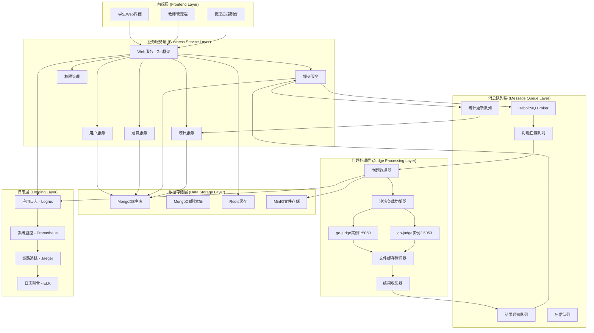
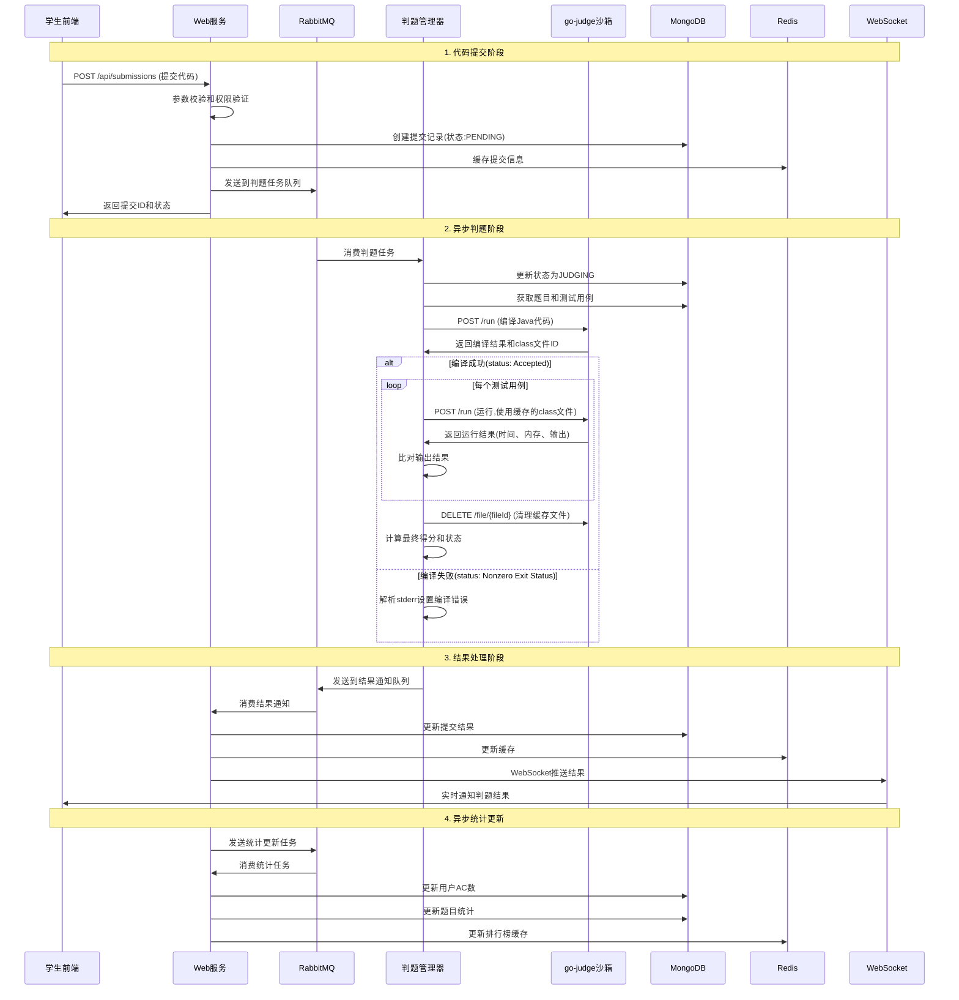

# 校园Java-OJ系统总体架构设计

## 📋 项目概述

**项目名称**: 校园Java-OJ在线判题系统  
**技术栈**: Go + MongoDB + RabbitMQ + go-judge  
**目标用户**: 100-200名在校学生  
**核心功能**: Java代码在线评测、题库管理、用户管理、成绩统计

## 🏗️ 总体架构设计

### 1. 六层架构模型



### 2. 架构层次详解

#### 2.1 前端层 (Frontend Layer)
- **学生Web界面**: 题目浏览、代码提交、成绩查看
- **教师管理端**: 题目管理、班级统计、作业布置
- **管理员控制台**: 系统配置、用户管理、监控面板

#### 2.2 业务服务层 (Business Service Layer)
- **Web服务**: 基于Gin框架的HTTP服务器
- **用户服务**: 认证、授权、用户信息管理
- **题目服务**: 题目CRUD、测试用例管理
- **提交服务**: 代码提交、状态查询、历史记录
- **统计服务**: 用户排名、解题统计、班级分析
- **权限管理**: RBAC权限控制、API鉴权

#### 2.3 消息队列层 (Message Queue Layer)
- **判题任务队列**: 接收代码提交任务
- **结果通知队列**: 判题结果回调
- **统计更新队列**: 异步更新用户统计
- **死信队列**: 处理失败任务

#### 2.4 判题处理层 (Judge Processing Layer)
- **判题管理器**: 任务调度、状态管理、编译运行流程控制
- **沙箱负载均衡器**: 多个go-judge实例的负载分发和健康检查
- **go-judge实例集群**: 基于REST API的安全代码执行环境
- **文件缓存管理器**: 管理编译产物(如.class文件)的缓存和清理
- **结果收集器**: 统一处理判题结果和错误信息
#### 2.5 数据存储层 (Data Storage Layer)
- **MongoDB**: 主要业务数据存储
- **Redis**: 缓存、会话存储
- **MinIO**: 测试用例文件存储

#### 2.6 日志层 (Logging Layer)
- **应用日志**: 业务操作记录
- **系统监控**: 性能指标采集
- **链路追踪**: 请求链路分析
- **日志聚合**: 集中日志管理

## 📁 项目目录结构

```
campus-java-oj/
├── cmd/                          # 应用程序入口
│   ├── server/                   # Web服务器
│   │   └── main.go
│   ├── judger/                   # 判题服务
│   │   └── main.go
│   ├── worker/                   # 异步任务处理器
│   │   └── main.go
│   └── migration/                # 数据库迁移工具
│       └── main.go
├── internal/                     # 内部包
│   ├── config/                   # 配置管理
│   │   ├── config.go
│   │   ├── mongodb.go
│   │   ├── redis.go
│   │   └── rabbitmq.go
│   ├── middleware/               # HTTP中间件
│   │   ├── auth.go              # JWT认证
│   │   ├── cors.go              # 跨域处理
│   │   ├── logger.go            # 请求日志
│   │   ├── ratelimit.go         # 限流控制
│   │   └── recover.go           # 异常恢复
│   ├── handler/                  # HTTP处理器
│   │   ├── auth/                # 认证相关
│   │   │   ├── login.go
│   │   │   ├── register.go
│   │   │   └── logout.go
│   │   ├── problem/             # 题目管理
│   │   │   ├── create.go
│   │   │   ├── update.go
│   │   │   ├── delete.go
│   │   │   ├── list.go
│   │   │   └── detail.go
│   │   ├── submission/          # 代码提交
│   │   │   ├── submit.go
│   │   │   ├── status.go
│   │   │   ├── list.go
│   │   │   └── detail.go
│   │   ├── user/                # 用户管理
│   │   │   ├── profile.go
│   │   │   ├── stats.go
│   │   │   └── list.go
│   │   └── admin/               # 管理功能
│   │       ├── dashboard.go
│   │       ├── users.go
│   │       └── system.go
│   ├── service/                  # 业务逻辑层
│   │   ├── interfaces/          # 服务接口定义
│   │   │   ├── auth.go
│   │   │   ├── problem.go
│   │   │   ├── submission.go
│   │   │   ├── user.go
│   │   │   └── stats.go
│   │   └── impl/                # 服务实现
│   │       ├── auth_service.go
│   │       ├── problem_service.go
│   │       ├── submission_service.go
│   │       ├── user_service.go
│   │       └── stats_service.go
│   ├── repository/               # 数据访问层
│   │   ├── interfaces/          # 仓库接口定义
│   │   │   ├── user.go
│   │   │   ├── problem.go
│   │   │   ├── submission.go
│   │   │   └── stats.go
│   │   └── mongodb/             # MongoDB实现
│   │       ├── user.go
│   │       ├── problem.go
│   │       ├── submission.go
│   │       └── stats.go
│   ├── model/                    # 数据模型
│   │   ├── user.go
│   │   ├── problem.go
│   │   ├── submission.go
│   │   ├── contest.go
│   │   └── stats.go
│   ├── judge/                    # 判题相关
│   │   ├── manager.go           # 判题管理器
│   │   ├── balancer.go          # 沙箱负载均衡器
│   │   ├── client.go            # go-judge HTTP客户端
│   │   ├── java_judge.go        # Java编译运行逻辑
│   │   ├── result_processor.go  # 判题结果处理器
│   │   ├── file_manager.go      # 缓存文件管理
│   │   ├── sandbox_pool.go      # 沙箱实例池管理
│   │   └── error_handler.go     # 错误处理和重试
│   ├── queue/                    # 消息队列
│   │   ├── producer.go          # 消息生产者
│   │   ├── consumer.go          # 消息消费者
│   │   ├── judge_task.go        # 判题任务
│   │   ├── result_handler.go    # 结果处理
│   │   └── stats_updater.go     # 统计更新
│   └── pkg/                      # 工具包
│       ├── database/            # 数据库连接
│       │   ├── mongodb.go
│       │   └── redis.go
│       ├── logger/              # 日志工具
│       │   ├── logger.go
│       │   └── context.go
│       ├── cache/               # 缓存工具
│       │   └── redis.go
│       ├── utils/               # 工具函数
│       │   ├── hash.go
│       │   ├── jwt.go
│       │   ├── response.go
│       │   ├── validator.go
│       │   └── pagination.go
│       └── errors/              # 错误定义
│           ├── codes.go
│           └── errors.go
├── api/                          # API定义
│   ├── openapi/                 # OpenAPI文档
│   │   └── swagger.yaml
│   └── proto/                   # gRPC定义(预留)
├── web/                          # 前端资源
│   ├── static/                  # 静态文件
│   ├── templates/               # HTML模板
│   └── dist/                    # 构建输出
├── configs/                      # 配置文件
│   ├── config.yaml
│   ├── config.example.yaml
│   ├── rbac.yaml               # 权限配置
│   └── judge.yaml              # 判题配置
├── deployments/                  # 部署配置
│   ├── docker/
│   │   ├── Dockerfile
│   │   ├── docker-compose.yml
│   │   └── docker-compose.prod.yml
│   ├── k8s/                     # Kubernetes配置
│   │   ├── namespace.yaml
│   │   ├── configmap.yaml
│   │   ├── deployment.yaml
│   │   └── service.yaml
│   └── scripts/                 # 部署脚本
│       ├── deploy.sh
│       ├── backup.sh
│       └── migrate.sh
├── docs/                         # 文档
│   ├── architecture.md         # 架构文档
│   ├── api.md                  # API文档
│   ├── deployment.md           # 部署文档
│   └── development.md          # 开发指南
├── tests/                        # 测试
│   ├── unit/                   # 单元测试
│   ├── integration/            # 集成测试
│   ├── e2e/                    # 端到端测试
│   └── fixtures/               # 测试数据
├── scripts/                      # 脚本工具
│   ├── build.sh                # 构建脚本
│   ├── test.sh                 # 测试脚本
│   ├── lint.sh                 # 代码检查
│   └── seed.sh                 # 数据初始化
├── go.mod                       # Go模块定义
├── go.sum                       # 依赖校验
├── Makefile                     # 构建配置
├── .gitignore
├── .dockerignore
├── README.md
└── LICENSE
```

## 🔄 判题流程业务分析

### 1. 完整判题流程图



### 2. 详细业务流程分析

#### 2.1 代码提交阶段 (100-200ms)

**核心步骤**:
1. **前端提交**: 学生在Web界面提交Java代码
2. **参数校验**: 验证代码长度、语言类型、题目存在性
3. **权限验证**: JWT token验证、提交权限检查
4. **防重复提交**: 检查短时间内重复提交
5. **创建记录**: MongoDB中创建提交记录，状态为PENDING
6. **缓存更新**: Redis中缓存最新提交信息
7. **任务入队**: 发送判题任务到RabbitMQ
8. **立即响应**: 返回提交ID，不等待判题结果

**关键代码逻辑**:
```go
type SubmitRequest struct {
    ProblemID string `json:"problem_id" binding:"required"`
    Code      string `json:"code" binding:"required,max=50000"`
    Language  string `json:"language" binding:"required,oneof=java"`
}

func (h *SubmissionHandler) Submit(c *gin.Context) {
    // 1. 参数校验
    var req SubmitRequest
    if err := c.ShouldBindJSON(&req); err != nil {
        response.Error(c, "参数错误")
        return
    }
    
    // 2. 防重复提交检查
    userID := middleware.GetUserID(c)
    if h.checkDuplicate(userID, req.Code) {
        response.Error(c, "请勿重复提交相同代码")
        return
    }
    
    // 3. 创建提交记录并入队
    submission, err := h.service.Submit(c, userID, req)
    if err != nil {
        response.Error(c, err.Error())
        return
    }
    
    // 4. 立即返回结果
    response.Success(c, gin.H{
        "submission_id": submission.ID,
        "status": "PENDING",
    })
}
```

#### 2.2 异步判题阶段 (2-30秒)

**核心步骤**:
1. **任务消费**: 判题管理器从RabbitMQ消费任务
2. **状态更新**: 更新提交状态为JUDGING
3. **获取数据**: 从MongoDB获取题目信息和测试用例
4. **实例选择**: 负载均衡器选择可用的go-judge实例
5. **代码编译**: 调用go-judge REST API编译Java代码
   - 请求: `POST /run` 包含javac命令和源码
   - 获取: 编译结果和缓存的.class文件ID
6. **测试执行**: 使用缓存文件ID逐个运行测试用例
   - 请求: `POST /run` 包含java命令和输入数据
   - 监控: CPU时间、内存使用、程序输出
7. **结果计算**: 比对输出、统计得分、时间、内存使用
8. **资源清理**: 删除go-judge中的缓存文件
9. **结果入队**: 将完整判题结果发送到结果队列

**判题任务结构**:
```go
type JudgeTask struct {
    SubmissionID primitive.ObjectID `json:"submission_id"`
    UserID       primitive.ObjectID `json:"user_id"`
    ProblemID    primitive.ObjectID `json:"problem_id"`
    Code         string             `json:"code"`
    Language     string             `json:"language"`
    TimeLimit    int                `json:"time_limit"`
    MemoryLimit  int                `json:"memory_limit"`
    TestCases    []TestCase         `json:"test_cases"`
    CreatedAt    time.Time          `json:"created_at"`
}
```

#### 2.3 结果处理阶段 (50-100ms)

**核心步骤**:
1. **结果消费**: Web服务消费判题结果
2. **数据更新**: 更新MongoDB中的提交记录
3. **缓存更新**: 更新Redis中的用户状态
4. **实时通知**: 通过WebSocket推送给前端
5. **统计任务**: 发送统计更新任务到队列

#### 2.4 异步统计更新 (后台处理)

**核心步骤**:
1. **统计消费**: 消费统计更新任务
2. **用户统计**: 更新用户AC题数、总提交数
3. **题目统计**: 更新题目通过率、提交次数
4. **排行榜**: 更新班级排行榜缓存
5. **推荐系统**: 根据用户表现推荐题目(预留)

### 3. 消息队列设计

#### 3.1 队列拓扑结构

```yaml
exchanges:
  - name: "campus.oj.topic"
    type: "topic"
    durable: true

queues:
  - name: "judge.task"
    routing_key: "task.judge.*"
    durable: true
    auto_delete: false
    
  - name: "judge.result"
    routing_key: "result.judge.*"
    durable: true
    auto_delete: false
    
  - name: "stats.update"
    routing_key: "update.stats.*"
    durable: true
    auto_delete: false
    
  - name: "notification"
    routing_key: "notify.*"
    durable: true
    auto_delete: false
    
  - name: "dead.letter"
    durable: true
    auto_delete: false
```

#### 3.2 消息格式定义

```go
// 判题任务消息
type JudgeTaskMessage struct {
    MessageID    string             `json:"message_id"`
    SubmissionID primitive.ObjectID `json:"submission_id"`
    Priority     int                `json:"priority"` // 1-10, 10最高
    RetryCount   int                `json:"retry_count"`
    CreatedAt    time.Time          `json:"created_at"`
    Payload      JudgeTask          `json:"payload"`
}

// go-judge编译请求
type CompileRequest struct {
    Cmd []CommandRequest `json:"cmd"`
}

// go-judge命令请求
type CommandRequest struct {
    Args          []string          `json:"args"`           // ["javac", "Main.java"]
    Env           []string          `json:"env"`            // Java环境变量
    Files         []FileDescriptor  `json:"files"`         // stdin/stdout/stderr
    CPULimit      int64            `json:"cpuLimit"`      // 纳秒
    MemoryLimit   int64            `json:"memoryLimit"`   // 字节
    ProcLimit     int              `json:"procLimit"`     // 进程数
    CopyIn        map[string]File  `json:"copyIn"`        // 输入文件
    CopyOut       []string         `json:"copyOut"`       // 输出文件
    CopyOutCached []string         `json:"copyOutCached"` // 缓存文件
}

// go-judge文件描述
type File struct {
    Content string `json:"content,omitempty"` // 文件内容
    FileID  string `json:"fileId,omitempty"`  // 缓存文件ID
}

// go-judge响应
type JudgeResponse struct {
    Status     string            `json:"status"`     // Accepted/Memory Limit Exceeded等
    ExitStatus int               `json:"exitStatus"` // 程序退出码
    Time       int64             `json:"time"`       // CPU时间(纳秒)
    Memory     int64             `json:"memory"`     // 内存使用(字节)
    RunTime    int64             `json:"runTime"`    // 墙钟时间(纳秒)
    Files      map[string]string `json:"files"`      // 输出文件内容
    FileIDs    map[string]string `json:"fileIds"`    // 缓存文件ID映射
    FileError  []FileError       `json:"fileError,omitempty"`
}

// 判题结果消息
type JudgeResultMessage struct {
    MessageID    string             `json:"message_id"`
    SubmissionID primitive.ObjectID `json:"submission_id"`
    Status       string             `json:"status"`
    Score        int                `json:"score"`
    TimeUsed     int                `json:"time_used"`
    MemoryUsed   int                `json:"memory_used"`
    TestResults  []TestResult       `json:"test_results"`
    CompileLog   string             `json:"compile_log,omitempty"`
    JudgedAt     time.Time          `json:"judged_at"`
}

// 统计更新消息
type StatsUpdateMessage struct {
    MessageID string             `json:"message_id"`
    UserID    primitive.ObjectID `json:"user_id"`
    ProblemID primitive.ObjectID `json:"problem_id"`
    Action    string             `json:"action"` // AC, WA, TLE, etc.
    Timestamp time.Time          `json:"timestamp"`
}
```

### 4. 容错和监控机制

#### 4.1 消息队列容错
- **死信队列**: 处理失败的消息
- **重试机制**: 指数退避重试策略
- **消息持久化**: 确保消息不丢失
- **消费确认**: 处理完成后才确认消息

#### 4.2 判题服务容错
- **健康检查**: 定期检查go-judge状态
- **自动重启**: 沙箱异常时自动重启
- **负载均衡**: 多实例负载分发
- **资源监控**: CPU、内存使用监控

#### 4.3 数据一致性
- **事务处理**: MongoDB事务确保数据一致
- **最终一致性**: 统计数据允许短暂不一致
- **补偿机制**: 异常情况下的数据修复
- **审计日志**: 记录所有关键操作

这个架构设计充分考虑了AHUTOJ的成熟经验，结合MongoDB的灵活性和RabbitMQ的可靠性，为校园Java-OJ提供了一个可扩展、高可用的解决方案。